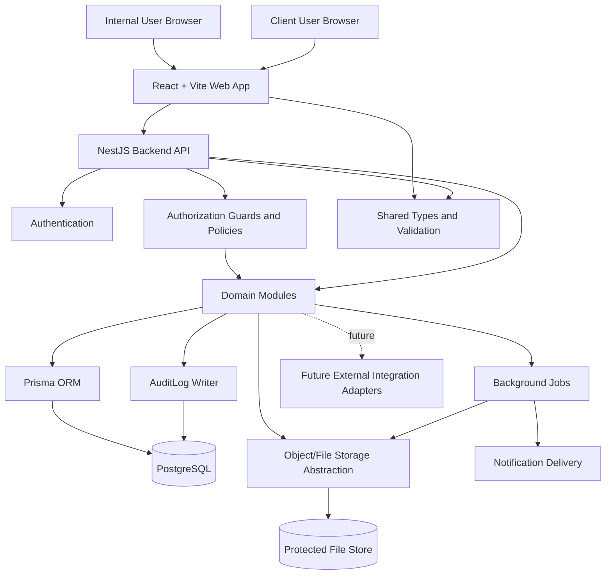

# Architecture

## Summary

Hire Me Platform should start as a TypeScript modular monolith in a monorepo. The recommended stack is a React + Vite web application, a NestJS backend API, PostgreSQL, Prisma ORM, shared validation and TypeScript types, Docker Compose for local services, an object/file storage abstraction, role-based authorization, audit logging, and background jobs.

This structure is simple enough for a single-developer MVP while preserving boundaries for future expansion.

## Architecture Principles

- Prefer a modular monolith over microservices for the initial product.
- Keep frontend, API, shared contracts, persistence, storage, background jobs, and integrations separated by clear interfaces.
- Treat authentication, authorization, audit logging, file access, and confidential data protection as cross-cutting concerns.
- Treat future external integrations as adapters behind interfaces.
- Avoid speculative application modules outside the confirmed scope.
- Preserve candidate history across multiple recruitment missions.

## Proposed Stack

### TypeScript Monorepo

A TypeScript monorepo should contain the web app, API, shared contracts, and shared tooling. This keeps the MVP easy to navigate and allows frontend and backend code to share validation schemas, workflow state names, and API contracts without publishing packages.

Potential future layout:

- `apps/web`: React + Vite frontend.
- `apps/api`: NestJS backend API.
- `packages/shared`: shared types, validation schemas, permission names, and workflow states.
- `packages/config`: shared TypeScript, linting, and test configuration.

No monorepo scaffolding is added in this task.

### React + Vite Frontend

React + Vite is appropriate for dashboards, forms, tables, client portal screens, and workflow controls. The frontend should use permissions to shape navigation and controls, but backend authorization remains the source of truth.

### NestJS Backend API

NestJS provides clear module boundaries, dependency injection, guards, validation, interceptors, scheduling, testing support, and predictable API structure. The API should own authorization, workflow transitions, audit logging, file access checks, and integration boundaries.

### PostgreSQL

PostgreSQL should be the primary database because the domain is relational and history-sensitive. It supports transactions, constraints, reporting queries, candidate-to-mission history, client relationships, permissions, and audit logs.

### Prisma ORM

Prisma should be used for typed database access and migrations once implementation begins. This task intentionally does not define a Prisma schema. The future schema should follow `docs/domain-model.md`, preserve history through explicit relations, and prefer archival for business records.

### Shared Validation and Types

Shared validation and types should live in a shared package so frontend and backend code agree on API payloads, workflow states, permission names, and domain identifiers. A validation library can be selected during implementation.

### Docker Compose for Local Services

Docker Compose should run local services such as PostgreSQL and any selected queue or storage emulator. Compose files are intentionally deferred to a later implementation task.

### Object/File Storage Abstraction

Candidate CVs, HR documents, generated documents, and client-facing documents should be accessed through a storage service interface. Feature modules should not call a provider directly. Storage must support protected download paths, randomized storage keys, file metadata, ownership checks, and future malware scanning.

### Authentication and Authorization

Authentication and authorization should be separated.

Recommended authorization approach:

- `User` records authenticate into the platform.
- `User` records receive one or more `Role` records.
- `Role` records grant explicit `Permission` records.
- Backend guards enforce permissions and record scope.
- Client users receive client-scoped permissions only.
- Deny-by-default policy checks protect candidate, HR, salary, CV, client, document, export, and commercial data.

Implementation should use short-lived sessions or tokens with safe refresh and revocation. Password hashing, identity provider support, and session storage details remain unresolved.

### Audit Logging

The backend should write `AuditLog` records for sensitive or business-critical actions, including:

- user administration and permission changes
- candidate, client, mission, and training archival or deletion
- candidate export and report export
- document upload, generated document creation, and document download
- client portal sharing
- commercial-data access
- workflow state transitions
- authentication and security-sensitive failures when appropriate

Audit logs should include actor, action, entity type, entity id, timestamp, request context, and safe before/after metadata where useful. Audit logs must not store secrets, raw CV contents, sensitive document contents, or full confidential payloads.

### Background Jobs

Background jobs should handle work that should not block API responses, such as notifications, document generation, scheduled reminders, export preparation, and reporting snapshots.

The initial queue technology is unresolved. A NestJS-compatible queue backed by Redis or PostgreSQL should be evaluated during implementation.

### Testing Strategy

Testing should match risk and behavior:

- Unit tests for workflow transitions, permission checks, validation schemas, and domain services.
- Integration tests for API behavior, persistence, authorization scopes, storage adapters, and background jobs.
- Frontend tests for permission-aware rendering, forms, workflow controls, and client portal behavior.
- End-to-end tests for the main recruitment workflow, client portal access, document download controls, and training workflow.
- Migration and schema validation tests once Prisma is introduced.

## Container and Component Diagram

## Assumptions

- The first product surface is a web application.
- Backend authorization is mandatory for every protected operation.
- Local development services will be introduced with Docker Compose in a later task.
- External integrations remain future adapters until a concrete integration issue is approved.

## Unresolved Decisions

- Authentication provider, password policy, session storage, token lifetime, and revocation model.
- Background job queue technology.
- Production object storage provider.
- Whether internal private messaging needs real-time delivery in the MVP.
- First dashboard metrics and reporting depth.
- Exact validation library for shared schemas.

## Risks

- A shared package can accidentally expose server-only types or secrets to the frontend if boundaries are weak.
- Missing record-scope checks can create insecure direct object reference exposure.
- Document storage without protected download paths can expose CVs and HR files.
- Audit logs can become sensitive data stores if they capture full payloads.
- Overbuilding infrastructure before product workflows are confirmed can slow the MVP.

## Non-Goals

- No application scaffolding.
- No Prisma schema or database migrations.
- No Docker Compose or CI configuration.
- No production deployment design.
- No external integration implementation.
