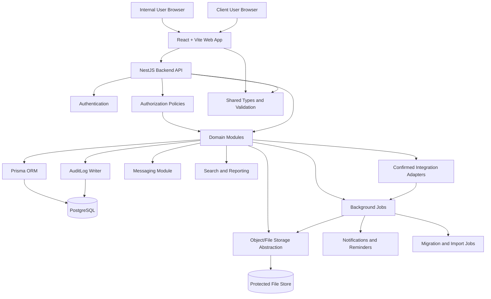

# Architecture

## Summary

Hire Me Platform should start as a TypeScript modular monolith in a monorepo. The recommended stack is a React + Vite web application, a NestJS backend API, PostgreSQL, Prisma ORM, shared validation and TypeScript types, Docker Compose for local services, an object/file storage abstraction, role-based authorization, audit logging, background jobs, integration adapters, and protected document storage.

This structure is simple enough for a single-developer MVP while preserving boundaries for future expansion and the confirmed V1 and roadmap requirements.

## Confirmed Product Requirements Affecting Architecture

- French and English interface support.
- Responsive web support.
- Advanced multi-criteria search.
- Customizable dashboards and exportable reports.
- Automatic reminders and notifications.
- Real-time internal notifications.
- Audit logs for sensitive and business-critical actions, including successful user connections and logins.
- Backups and restore expectations.
- Confidential-data protection for candidate, HR, salary, CV, client, commercial, message, document, export, and audit data.
- Module-by-module validation and UAT.
- Confirmed dashboard metrics: active missions, candidates presented to clients, successful placements, upcoming tasks, and revenue.
- Confirmed integration and output requirements for Microsoft 365 authentication, Outlook/Microsoft email and contacts, Outlook Calendar, Google Calendar, SMTP or Outlook email, WhatsApp Business reminders, LinkedIn-assisted candidate creation/profile links, Excel import/export, PDF generation, Word-compatible output, protected document storage, and real-time internal notifications.

## Architecture Principles

- Prefer a modular monolith over microservices for the initial product.
- Keep frontend, API, shared contracts, persistence, storage, background jobs, notifications, messaging, reporting, import, and integrations separated by clear interfaces.
- Treat authentication, authorization, audit logging, file access, backups, imports, and confidential-data protection as cross-cutting concerns.
- Treat integrations as adapters behind interfaces.
- Avoid speculative application modules outside the confirmed scope.
- Preserve candidate history across multiple recruitment missions.
- Support multiple recruiters per mission through `MissionAssignment`.
- Support participant-specific training lifecycle data through `TrainingEnrollment`.

## Proposed Stack

### TypeScript Monorepo

A TypeScript monorepo should contain the web app, API, shared contracts, and shared tooling. This keeps the MVP easy to navigate and allows frontend and backend code to share validation schemas, workflow state names, permission names, and API contracts without publishing packages.

Potential future layout:

- `apps/web`: React + Vite frontend.
- `apps/api`: NestJS backend API.
- `packages/shared`: shared types, validation schemas, permission names, workflow states, and integration contract types.
- `packages/config`: shared TypeScript, linting, and test configuration.

No monorepo scaffolding is added in this task.

### React + Vite Frontend

React + Vite is appropriate for dashboards, forms, tables, responsive client portal screens, multilingual UI, search, reporting, workflow controls, and internal messaging. The frontend should use permissions to shape navigation and controls, but backend authorization remains the source of truth.

### NestJS Backend API

NestJS provides clear module boundaries, dependency injection, guards, validation, interceptors, scheduling, testing support, and predictable API structure. The API should own authorization, workflow transitions, audit logging, file access checks, data import validation, notification dispatch, and integration boundaries.

### PostgreSQL

PostgreSQL should be the primary database because the domain is relational and history-sensitive. It supports transactions, constraints, reporting queries, candidate-to-mission history, mission assignments, training enrollments, client relationships, permissions, messages, document metadata, and audit logs.

### Prisma ORM

Prisma is owned by `apps/api`. The API package owns the schema, migrations, Prisma dependencies, generated client output, seed, and database integration tests. `apps/web` and `packages/contracts` must not depend on Prisma, import `@prisma/client`, import the API generated client, or import API persistence modules.

Issue #3 introduces the foundational Prisma schema under `apps/api/prisma/schema.prisma`. The Prisma 6 generator uses `prisma-client-js` with explicit output at `apps/api/prisma/generated/client`; that output is generated during development and CI and is not committed. API persistence code, seed scripts, and database tests must import through `apps/api/src/persistence/prisma/generated-client.ts` instead of importing `@prisma/client` directly.

Future Nest runtime code must expose one application-managed Prisma provider from the API persistence layer. Feature modules must not create ad-hoc `new PrismaClient()` instances. Seed and database integration tests may create their own clients because they run as separate processes.

### Shared Validation and Types

Shared validation and types should live in a shared package so frontend and backend code agree on API payloads, workflow states, permission names, domain identifiers, import row validation, and integration adapter contracts. A validation library can be selected during implementation.

### Docker Compose for Local Services

Docker Compose should run local services such as PostgreSQL and any selected queue or storage emulator. Compose files are intentionally deferred to a later implementation task.

### Object/File Storage Abstraction

Uploaded CVs, HR documents, quotations, purchase orders, contracts, invoice documents, generated PDF/Word/Excel files, training documents, message attachments, and client-facing files should be accessed through a storage service interface. Feature modules should not call a provider directly. Business records such as candidate summaries, evaluations, presentations, job-description content, pipeline events, placement confirmations, client feedback, and mission closure are not documents solely because they may later be exported.

Storage must support protected download paths, randomized storage keys, file metadata, version history, ownership checks, explicit sharing rules, access audit logs, and future malware scanning.

### Authentication and Authorization

Authentication and authorization should be separated.

Recommended authorization approach:

- `User` records authenticate into the platform.
- `User` records receive one or more `Role` records.
- `Role` records grant explicit `Permission` records.
- Backend guards enforce permissions and record scope.
- Client users receive client-scoped permissions only.
- Guest users receive only individually shared read-only access.
- Commercial-data permissions are explicit assignments, not broad role defaults.
- Deny-by-default policy checks protect candidate, HR, salary, CV, client, message, document, export, and commercial data.

Issue #10 implements the first local authentication foundation:

- email/password login against normalized user email addresses
- Argon2id password hashes stored in `PasswordCredential`
- short-lived bearer access tokens
- opaque rotating refresh tokens stored only as hashes in `RefreshSession`
- refresh-token reuse detection with session-family revocation
- HTTP-only refresh cookies; no browser `localStorage` or `sessionStorage` token persistence
- one Nest-managed Prisma provider for runtime persistence
- normalized permission-code resolution through `UserRole`, `RolePermission`, and `Permission`
- deny-by-default authorization guards
- safe authentication audit logs, including successful login events
- central protected-request account eligibility checks, so suspended or archived users cannot keep authorizing requests with still-unexpired access tokens

Issue #13 implements the first secured internal user administration module:

- versioned `/v1/admin` endpoints for internal user listing, safe detail, creation, profile updates, role assignment/removal, status changes, session summaries, session revocation, role catalog reads, permission catalog reads, and effective-permission previews
- shared Zod contracts that keep web and contracts Prisma-independent
- permission-code authorization rather than hard-coded role checks
- role assignment limited to roles whose permissions are within the actor's effective permissions
- transaction-protected last active `SUPER_ADMIN` invariant
- self-demotion, self-suspension, and self-archival prevention
- atomic refresh-session revocation when users are suspended or archived
- immediate protected-request rejection for suspended or archived users through the central auth guard
- safe administration audit summaries without passwords, token hashes, cookies, secrets, or confidential payloads

Microsoft 365 authentication, identity-provider linking, MFA, password reset, registration, invitations, arbitrary role creation, permission editing, and final business record-scope policy behavior remain later implementation work.

Issue #15 implements the first client CRM business module:

- versioned `/v1/clients` endpoints for client listing, creation, detail, updates, lifecycle status changes, archival, nested contact listing, contact creation, contact detail, contact updates, contact status changes, and contact archival
- shared Zod contracts in `packages/contracts` with no Prisma imports
- API-owned Prisma access through the Nest `PrismaService`
- explicit client and client-contact permission codes with deny-by-default behavior for unresolved row scopes
- commercial client fields returned only when `commercial_data:access` is effective
- transaction-scoped parent-client row locking for client archival and every dependent client/contact write so concurrent archival cannot be bypassed by a later ordinary mutation
- PostgreSQL-backed tests for per-client contact email uniqueness, IDOR protection, lifecycle and archival rules, concurrent archival races, authorization, and safe audit metadata

Issue #17 implements the first candidate master/profile business module:

- versioned `/v1/candidates` endpoints for candidate listing, creation, detail, updates, lifecycle status changes, archival, and structured nested skills, languages, work experience, and education list/create/update/archive operations
- shared Zod contracts in `packages/contracts` with no Prisma imports
- API-owned Prisma access through the Nest `PrismaService`
- explicit candidate, candidate-profile, candidate-compensation, and candidate-consent permission codes with deny-by-default behavior for unresolved row scopes
- candidate detail and mutation responses shaped by the caller's effective permissions, so mutation permissions do not imply structured profile visibility
- compensation and consent fields returned or accepted only when their dedicated permissions are effective
- transaction-scoped parent-candidate row locking for candidate archival and every dependent candidate/profile write so concurrent archival cannot be bypassed by a later ordinary mutation
- PostgreSQL-backed tests for normalized-email duplicate rejection, IDOR protection, lifecycle and archival rules, concurrent archival races, authorization, profile response redaction, sensitive field gating, and safe audit metadata

Issue #19 implements the first recruitment mission and assignment module:

- versioned `/v1/missions` endpoints for mission listing, creation, detail, updates, lifecycle status changes, structured closure, archival, nested assignment listing, assignment creation, assignment updates, assignment archival, and atomic lead-recruiter replacement
- shared Zod contracts in `packages/contracts` with no Prisma imports
- API-owned Prisma access through the Nest `PrismaService`
- explicit mission, mission-assignment, and mission-commercial-data permission codes with deny-by-default behavior for unresolved row scopes
- mission salary and commercial fields returned or accepted only when dedicated mission commercial permissions are effective
- transaction-scoped parent-mission row locking for lifecycle changes, closure, archival, ordinary mission writes, assignment writes, lead replacement, assignment activation eligibility, and effective salary-range validation so concurrent archival, terminal closure, assignee status changes, or partial salary updates cannot bypass invariants
- PostgreSQL-backed tests for lifecycle/closure invariants, protected commercial fields, assignment eligibility, assignment uniqueness, lead uniqueness, IDOR protection, authorization, salary-range validation, and archival races

Issue #21 implements the mission-candidate process module:

- versioned nested `/v1/missions/:missionId/candidates` endpoints for process listing, creation, detail, pipeline transition, responsible-recruiter transfer, explicit client presentation, and manual integration confirmation
- shared Zod contracts in `packages/contracts` with no Prisma imports
- API-owned Prisma access through the Nest `PrismaService`
- one reusable candidate linked to one recruitment mission through a permanently unique `(missionId, candidateId)` process
- one standard client-approved pipeline with only two approved optional skips, each requiring an explicit skip flag, reason, and audit event
- exactly one responsible recruiter at a time; responsible recruiters must be active, internal, non-archived, and actively assigned to the mission
- transaction-scoped PostgreSQL lock ordering of parent `RecruitmentMission`, existing `MissionCandidate` when present, then parent `Candidate` for lifecycle, ownership, presentation, integration, archival-race, and duplicate-prevention writes
- explicit presentation boundary: linking is internal-only, and client visibility starts only from the presentation action
- manual idempotent integration confirmation increments placement count once and never closes the mission automatically
- live candidate compensation and consent fields are redacted unless the caller has the dedicated candidate permissions; internal process notes require mission-candidate note permission
- PostgreSQL-backed tests for permanent uniqueness, concurrent duplicate creation, pipeline transitions and optional skips, responsible-recruiter transfer, presentation visibility, manual placement confirmation, IDOR, protected-field redaction, candidate archival races, and mission archival races

Training, documents, client portal activation, messaging, dashboards, exports, integrations, uploads, physical deletion, interviews, evaluations, offers, structured client feedback, and broader business workflow behavior remain later implementation work.

### Audit Logging

The backend should write `AuditLog` records for sensitive or business-critical actions, including:

- authentication and security-sensitive failures when appropriate
- user administration and permission changes
- candidate, client, mission, and training archival or deletion
- candidate export and report export
- successful user connections and logins
- document upload, generated document creation, explicit document version creation, sharing, and download
- client portal sharing
- commercial-data access
- workflow state transitions
- mission assignment changes
- training enrollment approval, payment status change, session attendance, evaluation, certificate, and follow-up changes
- message attachment downloads and sensitive conversation membership changes
- import validation, administrator approval, and import completion

Audit logs should include actor, action, entity type, entity id, timestamp, request context, and safe before/after metadata where useful. Audit logs must not store secrets, raw CV contents, sensitive document contents, message bodies, or full confidential payloads.

### Background Jobs

Background jobs should handle work that should not block API responses, such as notifications, document generation, scheduled reminders, export preparation, import processing, duplicate detection, integrity checks, PDF generation, Word-compatible document generation, Excel-compatible report generation, email delivery, WhatsApp Business reminders, integration synchronization, and reporting snapshots.

The initial queue technology is an unresolved technical choice. A NestJS-compatible queue backed by Redis or PostgreSQL should be evaluated during implementation.

### Search and Reporting

Advanced multi-criteria search should be designed as a backend capability with permission-aware filters. Initial data volumes are moderate but large enough to require indexes for candidate, CV metadata, client, mission, interview, evaluation, document, and training queries.

Confirmed dashboard metrics are active missions, candidates presented to clients, successful placements, upcoming tasks, and revenue. Dashboards and reporting must be customizable. Exact formulas, time windows, saved-view ownership, widget configuration, and authorization rules, especially for revenue, remain unresolved technical choices.

### Document Versioning and Outputs

Centralized documents should use a logical `Document` record with one or more `DocumentVersion` records. Candidate-specific CVs and attachments should use `CandidateDocument` with one or more `CandidateDocumentVersion` records. A new version represents a new stored file, generated output, or imported revision while preserving the logical document relationship.

Confirmed output families are PDF, Word-compatible document output, and Excel-compatible tabular or report output. Generated outputs include quotations, purchase orders, contracts, invoice documents, HR document templates, candidate summaries, interview reports, training documents, dashboards, and reports. Uploaded or stored-only files include raw CVs, candidate attachments, signed documents, client-provided files, external HR files, and imported legacy documents.

### Data Migration

The architecture must support initial migration of approximately:

- 3,000 to 5,000 candidates
- 3,000 to 5,000 CV files
- 200 to 500 clients and prospects
- 200 recruitment missions
- existing interviews, evaluations, commercial and HR documents, training data, users, and roles

Migration tooling should include duplicate detection, error reporting, integrity checks, administrator validation, and import summaries. Implementation should run migration work through background jobs and record audit logs for import approvals and results.

### Backups

Backups are a confirmed cross-cutting requirement. Exact backup provider, restore process, retention policy, and restore testing cadence are unresolved technical choices. Backup plans must cover PostgreSQL data and protected file storage metadata and objects.

### Testing Strategy

Testing should match risk and behavior:

- Unit tests for workflow transitions, permission checks, validation schemas, import validation, and domain services.
- Integration tests for API behavior, persistence, authorization scopes, storage adapters, background jobs, messaging membership, and integration adapters.
- Frontend tests for permission-aware rendering, multilingual UI behavior, responsive forms, workflow controls, dashboards, search, and client portal behavior.
- End-to-end tests for the main recruitment workflow, client portal access, document download controls, messaging permissions, training enrollment, and report export.
- Migration, schema validation, generated-client boundary, and relational integration tests for Prisma changes.
- Module-by-module validation and UAT before rollout.

## Container and Component Diagram

## Assumptions

- The first product surface is a responsive web application.
- Backend authorization is mandatory for every protected operation.
- Local development services will be introduced with Docker Compose in a later task.
- Confirmed integrations can be implemented after core modules without being removed from product scope.
- Migration scale requires indexed queries, background processing, validation reports, and administrator approval.

## Unresolved Technical Choices

- Microsoft 365 strategy, identity-provider account linking, MFA, password reset, production secret rotation, distributed rate limiting, and emergency session invalidation playbooks.
- Background job queue technology.
- Production object storage provider.
- Search implementation approach for advanced multi-criteria search.
- Real-time notification and messaging transport.
- Dashboard formulas, time windows, customization model, saved-view ownership, widget configuration, and authorization rules, especially for revenue.
- Exact validation library for shared schemas.
- Integration sync direction, conflict rules, rate limits, retry policy, and failure reporting.
- Backup provider, retention policy, and restore testing cadence.

## Risks

- A shared package can accidentally expose server-only types or secrets to the frontend if boundaries are weak.
- Missing record-scope checks can create insecure direct object reference exposure.
- Candidate duplicate handling remains intentionally conservative until review and merge workflows are designed.
- Document storage without protected download paths can expose CVs and HR files.
- Audit logs can become sensitive data stores if they capture full payloads.
- Integration jobs can leak confidential data if logging and retry metadata are not sanitized.
- Migration imports can create duplicates or corrupt relationships without administrator validation and integrity checks.
- Overbuilding infrastructure before product workflows are confirmed can slow the MVP.

## Non-Goals

- No registration, password reset, MFA, SSO, invitations, arbitrary role builder, permission-editing UI, business modules, business UI beyond the minimal internal administration screen, production file storage, or external integration implementation.
- No production deployment design.
