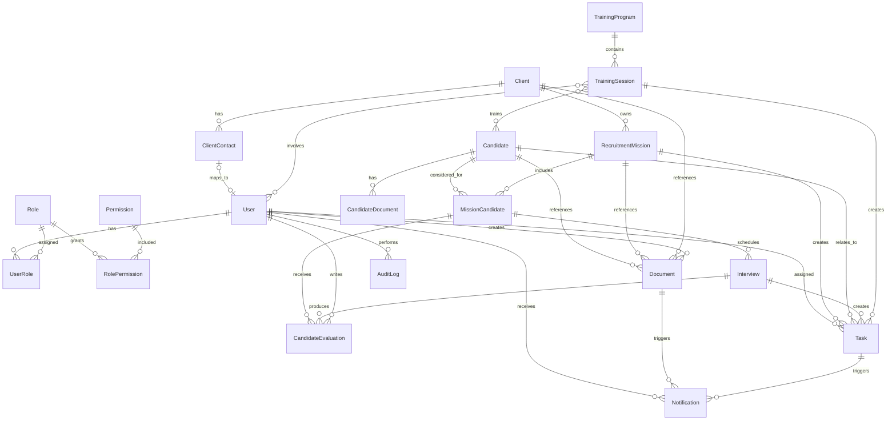

# Domain Model

This document defines conceptual entities and relationships for the first implementation phase. It is not a Prisma schema.

## Entity Catalog

### User

- Purpose and owner: authenticated platform actor owned by administration.
- Important attributes: id, name, email, status, user type, last login timestamp.
- Relationships: has roles through `UserRole`; may be linked to a `ClientContact`; may create documents, tasks, evaluations, notifications, and audit logs.
- Cardinality: many users can have many roles; one client contact may map to zero or one user.
- Lifecycle: active, suspended, archived.
- Sensitive fields: email, authentication metadata, profile information.
- Uniqueness rules: normalized email should be unique.
- Audit requirements: user creation, suspension, archival, role changes, and permission-sensitive access should be audited.

### Role

- Purpose and owner: named access profile owned by administration.
- Important attributes: id, name, description, status.
- Relationships: grants permissions through `RolePermission`; assigned to users through `UserRole`.
- Cardinality: many roles can be assigned to many users.
- Lifecycle: active, archived.
- Sensitive fields: role assignment can expose sensitive data indirectly.
- Uniqueness rules: role name should be unique.
- Audit requirements: role creation, updates, archival, and permission assignment changes should be audited.

### Permission

- Purpose and owner: explicit capability owned by administration.
- Important attributes: id, name, description, scope type.
- Relationships: granted to roles through `RolePermission`.
- Cardinality: many permissions can belong to many roles.
- Lifecycle: active, deprecated.
- Sensitive fields: permission names may reveal protected capability boundaries.
- Uniqueness rules: permission name should be unique.
- Audit requirements: permission grant and removal should be audited.

### Candidate

- Purpose and owner: person considered for recruitment, training, or coaching; owned by recruitment operations.
- Important attributes: id, name, contact details, status, source, consent status, salary expectations where approved.
- Relationships: has candidate documents; participates in mission pipelines through `MissionCandidate`; may attend training sessions; may be referenced by documents and tasks.
- Cardinality: one candidate can be linked to many recruitment missions.
- Lifecycle: active, inactive, archived.
- Sensitive fields: contact details, CV information, HR notes, salary expectations, evaluations, documents.
- Uniqueness rules: duplicate detection may use normalized email or phone, but final matching rules are unresolved.
- Audit requirements: creation, sensitive updates, export, archival, and document access should be audited.

### CandidateDocument

- Purpose and owner: candidate-specific file such as a CV, portfolio, certification, consent document, or HR attachment; owned by recruitment operations.
- Important attributes: id, candidate id, document type, filename, storage key, MIME type, size, visibility, uploaded by, status.
- Relationships: belongs to one candidate; may be shared through client portal rules.
- Cardinality: one candidate can have many candidate documents.
- Lifecycle: active, superseded, archived.
- Sensitive fields: CVs, certifications, identity information, HR documents, storage metadata.
- Uniqueness rules: storage key must be unique.
- Audit requirements: upload, download, visibility change, and archival should be audited.

### CandidateEvaluation

- Purpose and owner: structured assessment of a candidate; owned by recruitment operations.
- Important attributes: id, recommendation, score, feedback, evaluation type, created by, status.
- Relationships: belongs to a `MissionCandidate`; may belong to an `Interview`; written by a user.
- Cardinality: one mission candidate can have many evaluations; one interview can produce many evaluations.
- Lifecycle: draft, submitted, archived.
- Sensitive fields: interview notes, HR feedback, scoring, salary or compensation notes.
- Uniqueness rules: unresolved; duplicate evaluations may be allowed for multiple evaluators.
- Audit requirements: submission, updates after submission, and access should be audited.

### Client

- Purpose and owner: organization receiving recruitment services; owned by commercial and recruitment operations.
- Important attributes: id, name, status, industry, commercial owner, billing or contract summary where approved.
- Relationships: has client contacts, recruitment missions, documents, and client portal users through contacts.
- Cardinality: one client can have many contacts and missions.
- Lifecycle: prospect, active, inactive, archived.
- Sensitive fields: commercial terms, contracts, notes, private contacts.
- Uniqueness rules: client name uniqueness may be scoped by business rules and remains unresolved.
- Audit requirements: commercial-data access, updates, archival, and export should be audited.

### ClientContact

- Purpose and owner: person representing a client; owned by commercial and recruitment operations.
- Important attributes: id, client id, name, email, phone, role, portal access status.
- Relationships: belongs to one client; may map to one user.
- Cardinality: one client can have many contacts.
- Lifecycle: active, inactive, archived.
- Sensitive fields: contact details and communication notes.
- Uniqueness rules: normalized email should be unique within a client.
- Audit requirements: portal activation, update, archival, and access changes should be audited.

### RecruitmentMission

- Purpose and owner: client recruitment need; owned by recruitment operations.
- Important attributes: id, client id, title, description, requirements, status, priority, owner, commercial summary.
- Relationships: belongs to one client; has many mission candidates, interviews through mission candidates, tasks, documents, and notifications.
- Cardinality: one client can own many missions.
- Lifecycle: follows the recruitment mission pipeline in `docs/workflows.md`.
- Sensitive fields: role requirements, salary range, commercial terms, client notes.
- Uniqueness rules: mission identifiers should be unique; title uniqueness is not required.
- Audit requirements: creation, state transitions, commercial-data access, updates, archival, and export should be audited.

### MissionCandidate

- Purpose and owner: association between a candidate and a recruitment mission; owned by recruitment operations.
- Important attributes: id, candidate id, mission id, pipeline state, rank, source, submitted date, rejection reason.
- Relationships: belongs to one candidate and one recruitment mission; has interviews, evaluations, tasks, and notifications.
- Cardinality: one candidate can be linked to many missions; one mission can include many candidates.
- Lifecycle: follows the candidate pipeline in `docs/workflows.md`.
- Sensitive fields: status history, rejection reasons, interview feedback, client feedback.
- Uniqueness rules: candidate and mission pair should be unique for active records unless reapplication rules are later defined.
- Audit requirements: pipeline transitions, client submission, rejection, withdrawal, archival, and access should be audited.

### Interview

- Purpose and owner: scheduled or completed candidate meeting; owned by recruitment operations.
- Important attributes: id, mission candidate id, scheduled time, location or meeting link, status, participants, outcome.
- Relationships: belongs to one mission candidate; can produce candidate evaluations; can create tasks and notifications.
- Cardinality: one mission candidate can have many interviews.
- Lifecycle: scheduled, completed, canceled, archived.
- Sensitive fields: meeting links, participant details, interview notes, outcome.
- Uniqueness rules: no global uniqueness beyond id.
- Audit requirements: scheduling, rescheduling, cancellation, completion, and client-visible changes should be audited.

### Task

- Purpose and owner: assigned follow-up action; owned by the assigning team or user.
- Important attributes: id, title, description, status, due date, priority, assignee, related entity.
- Relationships: assigned to a user; may relate to a candidate, recruitment mission, mission candidate, interview, training session, document, or client.
- Cardinality: one user can have many tasks.
- Lifecycle: open, in progress, blocked, completed, canceled, archived.
- Sensitive fields: task notes may include confidential HR or commercial context.
- Uniqueness rules: no global uniqueness beyond id.
- Audit requirements: assignment, completion, sensitive updates, and archival should be audited when linked to confidential records.

### TrainingProgram

- Purpose and owner: structured training or coaching offer; owned by training operations.
- Important attributes: id, name, description, target audience, status, owner.
- Relationships: contains many training sessions.
- Cardinality: one training program can contain many sessions.
- Lifecycle: draft, active, retired, archived.
- Sensitive fields: participant targeting may reveal HR context.
- Uniqueness rules: program name uniqueness is unresolved.
- Audit requirements: publication, retirement, archival, and sensitive updates should be audited.

### TrainingSession

- Purpose and owner: scheduled training or coaching event; owned by training operations.
- Important attributes: id, training program id, scheduled time, status, trainer, participants, outcome.
- Relationships: belongs to a training program; may involve candidates and users; can create tasks and notifications.
- Cardinality: one program can have many sessions; one session can have many participants.
- Lifecycle: follows the training workflow in `docs/workflows.md`.
- Sensitive fields: attendance, coaching notes, outcomes, HR context.
- Uniqueness rules: no global uniqueness beyond id.
- Audit requirements: scheduling, participant changes, outcome recording, cancellation, and archival should be audited.

### Document

- Purpose and owner: general stored or generated document; owned by the module that creates it.
- Important attributes: id, title, document type, storage key, MIME type, size, visibility, generated status, owner.
- Relationships: may reference a candidate, client, recruitment mission, training session, or creator user.
- Cardinality: many documents can reference one business entity.
- Lifecycle: draft, active, superseded, archived.
- Sensitive fields: generated contracts, reports, client files, HR documents, storage metadata.
- Uniqueness rules: storage key must be unique.
- Audit requirements: generation, upload, download, sharing, visibility change, and archival should be audited.

### Notification

- Purpose and owner: system alert for a user; owned by the system.
- Important attributes: id, recipient user id, type, title, body summary, read status, related entity.
- Relationships: belongs to one user; may reference tasks, documents, interviews, missions, or training sessions.
- Cardinality: one user can receive many notifications.
- Lifecycle: unread, read, archived.
- Sensitive fields: notification text may reveal confidential information.
- Uniqueness rules: duplicate prevention rules are unresolved.
- Audit requirements: security-sensitive notification generation may be audited; notification contents should avoid confidential payloads.

### AuditLog

- Purpose and owner: append-only record of sensitive or business-critical action; owned by the system.
- Important attributes: id, actor user id, action, entity type, entity id, timestamp, request context, safe metadata.
- Relationships: may reference a user as actor; references entities by type and id.
- Cardinality: one user can perform many audited actions.
- Lifecycle: append-only; retention policy unresolved.
- Sensitive fields: request context and metadata can be sensitive.
- Uniqueness rules: no global uniqueness beyond id.
- Audit requirements: audit logs are themselves protected records and should not contain secrets or raw confidential document contents.

## Entity Relationship Diagram

## Relationship Notes

- `UserRole` and `RolePermission` are conceptual join entities.
- A `ClientContact` maps to a `User` only when client portal access is enabled.
- `MissionCandidate` preserves candidate history across multiple recruitment missions.
- `CandidateEvaluation` can be tied to an `Interview`, `MissionCandidate`, and evaluator `User`.
- `Document` represents general or generated documents. `CandidateDocument` represents candidate-specific files such as CVs.
- `AuditLog` should be append-only and protected from ordinary update or delete operations.

## Assumptions

- Entity names in this document should become implementation-facing names later.
- The ER diagram is conceptual and not a physical schema.
- Participant details for interviews and training sessions may require join entities during schema design.
- Archival is preferred over deletion for records that carry recruitment, HR, client, commercial, or audit history.

## Unresolved Decisions

- Whether client portal access supports one `User` across multiple `Client` records.
- Whether candidate consent, privacy preferences, and retention deadlines need dedicated MVP entities.
- Whether document templates should be modeled separately from `Document`.
- How private messaging and groups should be modeled.
- Whether salary expectations belong directly on `Candidate`, on `MissionCandidate`, or in restricted evaluation notes.

## Risks

- Missing archival rules can damage recruitment history and auditability.
- Storing confidential notes in broad entities can make access control harder.
- Weak uniqueness rules can create duplicate candidates, clients, and client contacts.
- Document and notification content can accidentally expose confidential data if summaries include too much detail.

## Non-Goals

- No Prisma schema.
- No database migrations.
- No seed data.
- No implementation of messaging, integrations, or document generation.
