# Domain Model

This document defines conceptual entities and relationships for the first implementation phase. It is not a Prisma schema.

## Entity Catalog

### User

- Purpose and owner: authenticated platform actor owned by administration.
- Important attributes: id, name, email, status, user type, last login timestamp, locale preference.
- Relationships: has roles through `UserRole`; may be linked to a `ClientContact`; may create documents, tasks, evaluations, messages, notifications, and audit logs; may be assigned to missions through `MissionAssignment`; may participate in training through `TrainingEnrollment`.
- Cardinality: many users can have many roles; one client contact may map to zero or one user; one user can have many mission assignments.
- Lifecycle: active, suspended, archived.
- Sensitive fields: email, authentication metadata, profile information.
- Uniqueness rules: normalized email should be unique.
- Audit requirements: user creation, suspension, archival, role changes, mission assignment changes, and permission-sensitive access should be audited.

### Role

- Purpose and owner: named access profile owned by administration.
- Important attributes: id, name, description, status.
- Relationships: grants permissions through `RolePermission`; assigned to users through `UserRole`.
- Cardinality: many roles can be assigned to many users.
- Lifecycle: active, archived.
- Sensitive fields: role assignment can expose sensitive data indirectly.
- Uniqueness rules: role name should be unique.
- Audit requirements: role creation, updates, archival, and permission assignment changes should be audited.

### Permission

- Purpose and owner: explicit capability owned by administration.
- Important attributes: id, name, description, scope type.
- Relationships: granted to roles through `RolePermission`.
- Cardinality: many permissions can belong to many roles.
- Lifecycle: active, deprecated.
- Sensitive fields: permission names may reveal protected capability boundaries.
- Uniqueness rules: permission name should be unique.
- Audit requirements: permission grant and removal should be audited.

### Candidate

- Purpose and owner: person considered for recruitment, training, or coaching; owned by recruitment operations.
- Important attributes: id, name, contact details, status, source, consent status, salary expectations where approved, LinkedIn profile link where provided.
- Relationships: has candidate documents; participates in mission pipelines through `MissionCandidate`; may participate in training through `TrainingEnrollment`; may be referenced by documents and tasks.
- Cardinality: one candidate can be linked to many recruitment missions and training enrollments.
- Lifecycle: active, inactive, talent pool, archived.
- Sensitive fields: contact details, CV information, HR notes, salary expectations, evaluations, documents.
- Uniqueness rules: duplicate detection may use normalized email, phone, LinkedIn profile, and CV metadata; final matching rules are unresolved.
- Audit requirements: creation, sensitive updates, export, archival, talent pool movement, and document access should be audited.

### CandidateDocument

- Purpose and owner: candidate-specific file such as a CV, portfolio, certification, consent document, or HR attachment; owned by recruitment operations.
- Important attributes: id, candidate id, document type, logical title, current version id, visibility, uploaded by, status.
- Relationships: belongs to one candidate; may be shared through client portal rules; may be referenced by generated `Document` records.
- Cardinality: one candidate can have many candidate documents; one candidate document can have many candidate document versions.
- Lifecycle: active, superseded, archived.
- Sensitive fields: CVs, certifications, identity information, HR documents, version metadata.
- Uniqueness rules: current version id should reference one version in the candidate document history.
- Audit requirements: upload, download, version creation, visibility change, and archival should be audited.

### CandidateDocumentVersion

- Purpose and owner: version record for one candidate-specific file; owned by recruitment operations.
- Important attributes: id, candidate document id, version number, filename, storage key, MIME type, size, created by, created date, source.
- Relationships: belongs to one `CandidateDocument`.
- Cardinality: one candidate document can have many versions.
- Lifecycle: active, superseded, archived.
- Sensitive fields: CV contents, storage keys, filename, metadata.
- Uniqueness rules: storage key must be unique; version number should be unique within one candidate document.
- Audit requirements: version creation, download, supersession, and archival should be audited.

### CandidateEvaluation

- Purpose and owner: structured assessment of a candidate; owned by recruitment operations.
- Important attributes: id, recommendation, score, feedback, evaluation type, created by, status.
- Relationships: belongs to a `MissionCandidate`; may belong to an `Interview`; written by a user.
- Cardinality: one mission candidate can have many evaluations; one interview can produce many evaluations.
- Lifecycle: draft, submitted, archived.
- Sensitive fields: interview notes, HR feedback, scoring, salary or compensation notes.
- Uniqueness rules: unresolved; duplicate evaluations may be allowed for multiple evaluators.
- Audit requirements: submission, updates after submission, and access should be audited.

### Client

- Purpose and owner: organization receiving recruitment or training services; owned by commercial and recruitment operations.
- Important attributes: id, name, status, industry, commercial owner, billing or contract summary where approved.
- Relationships: has client contacts, recruitment missions, documents, and client portal users through contacts; may sponsor training enrollments.
- Cardinality: one client can have many contacts, missions, documents, and client participant enrollments.
- Lifecycle: prospect, active, inactive, archived.
- Sensitive fields: commercial terms, contracts, invoices, notes, private contacts.
- Uniqueness rules: client name uniqueness may be scoped by business rules and remains unresolved.
- Audit requirements: commercial-data access, updates, archival, export, and document access should be audited.

### ClientContact

- Purpose and owner: person representing a client; owned by commercial and recruitment operations.
- Important attributes: id, client id, name, email, phone, role, portal access status.
- Relationships: belongs to one client; may map to one user; may participate in training through `TrainingEnrollment`.
- Cardinality: one client can have many contacts.
- Lifecycle: active, inactive, archived.
- Sensitive fields: contact details and communication notes.
- Uniqueness rules: normalized email should be unique within a client.
- Audit requirements: portal activation, update, archival, access changes, and training enrollment changes should be audited.

### RecruitmentMission

- Purpose and owner: client recruitment need; owned by recruitment operations.
- Important attributes: id, client id, title, description, requirements, mission state, priority, numberOfPositions, filledPlacementCount, closureReason, closure date, commercial summary.
- Relationships: belongs to one client; has many mission candidates; has many assigned recruiters or contributors through `MissionAssignment`; has interviews through mission candidates, tasks, documents, notifications, and messages.
- Cardinality: one client can own many missions; one mission can have many mission assignments and mission candidates.
- Lifecycle: follows the recruitment mission pipeline in `docs/workflows.md`, including draft, internal validation, active, job-description approval, candidate sourcing, HR preselection, HR interviews, technical tests, candidate presentation, client interviews, final selection, offer sent, candidate integration, probation monitoring, and closure.
- Sensitive fields: role requirements, salary range, commercial terms, client notes.
- Uniqueness rules: mission identifiers should be unique; title uniqueness is not required.
- Audit requirements: creation, assignment changes, state transitions, structured closure reason changes, commercial-data access, updates, archival, and export should be audited.

Confirmed `closureReason` values must cover client closed or canceled the mission, closed without recruitment, deadline expired without renewal, and all planned positions filled with candidates integrated, optionally after probation validation. Successful closure with recruitment must consider `numberOfPositions` and filled-placement count. Exact enum names can be finalized during persistence design.

### MissionAssignment

- Purpose and owner: assignment of a recruiter or contributor to a recruitment mission; owned by recruitment operations.
- Important attributes: id, mission id, user id, assignment role, assigned date, active status, lead recruiter flag, end date.
- Relationships: belongs to one `RecruitmentMission` and one `User`.
- Cardinality: one mission can have many assignments; one user can have many assignments.
- Lifecycle: active, inactive, archived.
- Sensitive fields: assignment role and workload may reveal client or HR context.
- Uniqueness rules: a user should not have duplicate active assignments with the same role on the same mission.
- Audit requirements: assignment creation, role change, lead recruiter change, deactivation, and archival should be audited.

### MissionCandidate

- Purpose and owner: association between a candidate and a recruitment mission; owned by recruitment operations.
- Important attributes: id, candidate id, mission id, candidate pipeline state, rank, source, presented date, rejection reason, closure reason.
- Relationships: belongs to one candidate and one recruitment mission; has interviews, evaluations, tasks, notifications, and documents.
- Cardinality: one candidate can be linked to many missions; one mission can include many candidates.
- Lifecycle: follows the candidate pipeline in `docs/workflows.md`, from `new` through closure or exceptional outcome states.
- Sensitive fields: status history, rejection reasons, interview feedback, client feedback, salary and offer details.
- Uniqueness rules: candidate and mission pair should be unique for active records unless reapplication rules are later defined.
- Audit requirements: pipeline transitions, client presentation, offer, acceptance, integration, probation monitoring, rejection, withdrawal, talent pool movement, archival, and access should be audited.

### Interview

- Purpose and owner: scheduled or completed candidate meeting; owned by recruitment operations.
- Important attributes: id, mission candidate id, interview type, scheduled time, location or meeting link, status, participants, outcome.
- Relationships: belongs to one mission candidate; can produce candidate evaluations; can create tasks and notifications.
- Cardinality: one mission candidate can have many interviews, including HR and client interviews.
- Lifecycle: scheduled, postponed, completed, canceled, archived.
- Sensitive fields: meeting links, participant details, interview notes, outcome.
- Uniqueness rules: no global uniqueness beyond id.
- Audit requirements: scheduling, rescheduling, postponement, cancellation, completion, and client-visible changes should be audited.

### Task

- Purpose and owner: assigned follow-up action; owned by the assigning team or user.
- Important attributes: id, title, description, status, due date, priority, assignee, related entity.
- Relationships: assigned to a user; may relate to mapped task contexts listed below.
- Cardinality: one user can have many tasks.
- Lifecycle: open, in progress, waiting, blocked, completed, canceled, archived.
- Sensitive fields: task notes may include confidential HR or commercial context.
- Uniqueness rules: no global uniqueness beyond id.
- Audit requirements: assignment, completion, sensitive updates, and archival should be audited when linked to confidential records.

Confirmed task contexts should map before persistence design:

| Confirmed task context | Entity or concept mapping |
| --- | --- |
| candidates | `Candidate` or `MissionCandidate` |
| clients | `Client` or `ClientContact` |
| missions | `RecruitmentMission` or `MissionAssignment` |
| interviews | `Interview` |
| training | `TrainingProgram`, `TrainingSession`, `TrainingEnrollment`, or `TrainingSessionParticipation` |
| internal projects | deferred `InternalProject` concept |
| users | `User` |
| commercial opportunities or prospects | `Client` with prospect lifecycle; fuller opportunity entity deferred |
| quotations | generated/stored `Document` of quotation type |
| invoices | generated/stored `Document` of invoice type |
| contracts | generated/stored `Document` of contract type |
| candidate integration | `MissionCandidate` states `accepted`, `integrated`, `probation_monitoring`, `end_of_probation` |
| probation | `MissionCandidate` and `RecruitmentMission` probation states |
| events or meetings | `Interview`, `TrainingSession`, or deferred `Event` concept |
| document approval | `Document`, `DocumentVersion`, `CandidateDocument`, or `CandidateDocumentVersion` |
| tender or pre-sales work | `Client`, prospect lifecycle, quotation `Document`, or deferred `Tender` concept |

### TrainingProgram

- Purpose and owner: structured training or coaching offer; owned by training operations.
- Important attributes: id, name, description, target audience, status, owner.
- Relationships: contains many training sessions; has many training enrollments.
- Cardinality: one training program can contain many sessions and enroll many participants.
- Lifecycle: draft, active, closed, archived.
- Sensitive fields: participant targeting may reveal HR or client context.
- Uniqueness rules: program name uniqueness is unresolved.
- Audit requirements: creation, publication, retirement, archival, and sensitive updates should be audited.

### TrainingSession

- Purpose and owner: scheduled training or coaching event; owned by training operations.
- Important attributes: id, training program id, scheduled time, status, trainer, location or meeting link, outcome.
- Relationships: belongs to a training program; has per-participant attendance through `TrainingSessionParticipation`; can create tasks, documents, and notifications.
- Cardinality: one program can have many sessions.
- Lifecycle: follows the training session workflow in `docs/workflows.md`.
- Sensitive fields: coaching notes, outcomes, HR context.
- Uniqueness rules: no global uniqueness beyond id.
- Audit requirements: scheduling, postponement, cancellation, completion, and archival should be audited.

### TrainingEnrollment

- Purpose and owner: participant-specific program-level registration and outcome record for training; owned by training operations.
- Important attributes: id, training program id, participant type, approval status, payment status, evaluation result, certificate status, satisfaction score, coaching status, follow-up status.
- Relationships: belongs to a `TrainingProgram`; may link to a `Candidate`, `User`, `ClientContact`, or `ExternalTrainingParticipant`; has session attendance records through `TrainingSessionParticipation`.
- Cardinality: one program can have many enrollments; one participant can have many enrollments.
- Lifecycle: registered, approved, rejected, payment pending, enrolled, evaluated, individual coaching, certified, satisfaction recorded, follow-up, closed, canceled.
- Sensitive fields: payment status, evaluation, coaching notes, satisfaction, certificate outcome.
- Uniqueness rules: active duplicate enrollment rules are unresolved and may depend on participant type.
- Audit requirements: registration, approval, payment status, evaluation, certificate, satisfaction, coaching, follow-up, cancellation, and closure should be audited.

### TrainingSessionParticipation

- Purpose and owner: per-session participant attendance and session-level outcome record; owned by training operations.
- Important attributes: id, training session id, training enrollment id, attendance status, session outcome, trainer notes, completion status.
- Relationships: belongs to one `TrainingSession` and one `TrainingEnrollment`.
- Cardinality: one training session can have many session participations; one training enrollment can have many session participations across program sessions.
- Lifecycle: expected, attended, absent, excused, session outcome recorded, archived.
- Sensitive fields: attendance, trainer notes, session-level outcome.
- Uniqueness rules: one participation record per enrollment per session.
- Audit requirements: attendance, outcome, absence, trainer-note changes, and archival should be audited.

### ExternalTrainingParticipant

- Purpose and owner: participant who is not represented by `Candidate`, `User`, or `ClientContact`; owned by training operations.
- Important attributes: id, name, email, phone, organization, notes, status.
- Relationships: can participate in training through `TrainingEnrollment`.
- Cardinality: one external participant can have many enrollments.
- Lifecycle: active, inactive, archived.
- Sensitive fields: contact details and training notes.
- Uniqueness rules: normalized email may be unique when present.
- Audit requirements: creation, update, enrollment, and archival should be audited.

### Document

- Purpose and owner: general stored, versioned, or generated document; owned by the module that creates it.
- Important attributes: id, title, document type, current version id, visibility, generated status, output family, owner.
- Relationships: may reference a candidate, client, recruitment mission, mission candidate, interview, training session, training enrollment, conversation, message, or creator user.
- Cardinality: many documents can reference one business entity; one document can have many document versions.
- Lifecycle: draft, active, superseded, archived.
- Sensitive fields: quotations, purchase orders, contracts, invoices, HR documents, reports, client files, storage metadata.
- Uniqueness rules: current version id should reference one version in the document history.
- Audit requirements: generation, upload, version creation, download, sharing, visibility change, and archival should be audited.

### DocumentVersion

- Purpose and owner: version record for one logical `Document`; owned by the module that owns the document.
- Important attributes: id, document id, version number, filename, storage key, MIME type, size, output family, created by, created date, source.
- Relationships: belongs to one `Document`.
- Cardinality: one document can have many versions.
- Lifecycle: active, superseded, archived.
- Sensitive fields: storage key, document contents, generated output metadata.
- Uniqueness rules: storage key must be unique; version number should be unique within one document.
- Audit requirements: version creation, download, supersession, sharing, and archival should be audited.

### Notification

- Purpose and owner: system alert for a user; owned by the system.
- Important attributes: id, recipient user id, type, title, body summary, read status, related entity.
- Relationships: belongs to one user; may reference tasks, documents, interviews, missions, training enrollments, conversations, or messages.
- Cardinality: one user can receive many notifications.
- Lifecycle: unread, read, archived.
- Sensitive fields: notification text may reveal confidential information.
- Uniqueness rules: duplicate prevention rules are unresolved.
- Audit requirements: security-sensitive notification generation may be audited; notification contents should avoid confidential payloads.

### Conversation

- Purpose and owner: private message thread or discussion group; owned by collaboration features.
- Important attributes: id, conversation type, title, related entity type, related entity id, status.
- Relationships: has conversation members, messages, and optional documents or attachments.
- Cardinality: one conversation can have many members and messages.
- Lifecycle: active, archived.
- Sensitive fields: title, membership, related entity, and message context.
- Uniqueness rules: unresolved; direct conversation uniqueness may be enforced later.
- Audit requirements: membership changes, archival, and attachment downloads should be audited when linked to confidential records.

### ConversationMember

- Purpose and owner: participant membership in a conversation; owned by collaboration features.
- Important attributes: id, conversation id, user id, member role, joined date, muted status, active status.
- Relationships: belongs to one conversation and one user.
- Cardinality: one conversation can have many members; one user can belong to many conversations.
- Lifecycle: active, inactive, archived.
- Sensitive fields: membership can reveal confidential client or candidate activity.
- Uniqueness rules: one active membership per user per conversation.
- Audit requirements: add, remove, role change, and archival should be audited for sensitive conversations.

### Message

- Purpose and owner: message posted in a private conversation or discussion group; owned by collaboration features.
- Important attributes: id, conversation id, author user id, body, status, created date, edited date.
- Relationships: belongs to one conversation; written by one user; may have message attachments through `Document`.
- Cardinality: one conversation can have many messages.
- Lifecycle: active, edited, archived.
- Sensitive fields: message body and attachments may include candidate, HR, client, or commercial data.
- Uniqueness rules: no global uniqueness beyond id.
- Audit requirements: message deletion or archival and attachment access should be audited; audit logs should not store full message bodies.

### AuditLog

- Purpose and owner: append-only record of sensitive or business-critical action; owned by the system.
- Important attributes: id, actor user id, action, entity type, entity id, timestamp, request context, safe metadata.
- Relationships: may reference a user as actor; references entities by type and id.
- Cardinality: one user can perform many audited actions.
- Lifecycle: append-only; retention policy unresolved.
- Sensitive fields: request context and metadata can be sensitive.
- Uniqueness rules: no global uniqueness beyond id.
- Audit requirements: audit logs are protected records and should not contain secrets, raw confidential document contents, or full message bodies. Successful user connections and logins are confirmed audit events.

## Entity Relationship Diagram

```mermaid
erDiagram
    User ||--o{ UserRole : has
    Role ||--o{ UserRole : assigned
    Role ||--o{ RolePermission : grants
    Permission ||--o{ RolePermission : included

    Client ||--o{ ClientContact : has
    ClientContact o|--o| User : maps_to
    Client ||--o{ RecruitmentMission : owns

    RecruitmentMission ||--o{ MissionAssignment : staffed_by
    User ||--o{ MissionAssignment : assigned_to

    Candidate ||--o{ CandidateDocument : has
    CandidateDocument ||--o{ CandidateDocumentVersion : versions
    Candidate ||--o{ MissionCandidate : considered_for
    RecruitmentMission ||--o{ MissionCandidate : includes

    MissionCandidate ||--o{ Interview : schedules
    MissionCandidate ||--o{ CandidateEvaluation : receives
    Interview ||--o{ CandidateEvaluation : produces
    User ||--o{ CandidateEvaluation : writes

    User ||--o{ Task : assigned
    RecruitmentMission ||--o{ Task : creates
    Candidate ||--o{ Task : relates_to
    Interview ||--o{ Task : creates
    TrainingEnrollment ||--o{ Task : creates

    TrainingProgram ||--o{ TrainingSession : contains
    TrainingProgram ||--o{ TrainingEnrollment : enrolls
    Candidate ||--o{ TrainingEnrollment : participates
    User ||--o{ TrainingEnrollment : participates
    ClientContact ||--o{ TrainingEnrollment : participates
    ExternalTrainingParticipant ||--o{ TrainingEnrollment : participates
    TrainingSession ||--o{ TrainingSessionParticipation : records
    TrainingEnrollment ||--o{ TrainingSessionParticipation : attends

    Candidate ||--o{ Document : references
    RecruitmentMission ||--o{ Document : references
    MissionCandidate ||--o{ Document : references
    Client ||--o{ Document : references
    TrainingSession ||--o{ Document : references
    TrainingEnrollment ||--o{ Document : references
    Document ||--o{ DocumentVersion : versions
    User ||--o{ Document : creates

    User ||--o{ Notification : receives
    Document ||--o{ Notification : triggers
    Task ||--o{ Notification : triggers

    Conversation ||--o{ ConversationMember : has
    User ||--o{ ConversationMember : joins
    Conversation ||--o{ Message : contains
    User ||--o{ Message : writes
    Message ||--o{ Document : attaches

    User ||--o{ AuditLog : performs
```

## Relationship Notes

- `UserRole` and `RolePermission` are conceptual join entities.
- A `ClientContact` maps to a `User` only when client portal access is enabled.
- `MissionAssignment` replaces a single mission owner as the model for multiple recruiters and contributors.
- `MissionCandidate` preserves candidate history across multiple recruitment missions.
- `CandidateEvaluation` can be tied to an `Interview`, `MissionCandidate`, and evaluator `User`.
- `TrainingEnrollment` owns participant-specific program registration, approval, payment, evaluation, certificate, satisfaction, coaching, and follow-up state.
- `TrainingSessionParticipation` owns per-session attendance and session-level outcomes.
- `Document` represents logical centralized and generated documents; `DocumentVersion` stores each version and file output.
- `CandidateDocument` represents logical candidate-specific files such as CVs; `CandidateDocumentVersion` stores each candidate-file version.
- `Conversation`, `ConversationMember`, and `Message` represent confirmed private messaging and discussion groups.
- `AuditLog` should be append-only and protected from ordinary update or delete operations.

## Prisma Implementation Notes

Issue #3 implements the foundational Prisma schema as the first physical persistence model. It keeps the conceptual relationships above, with these explicit implementation choices:

- The physical schema uses `MissionRecruiter` for the first recruiter-assignment join required by issue #3. It fulfills the approved `MissionAssignment` requirement for multiple recruiters on one `RecruitmentMission`; broader non-recruiter contributor assignment can be extended in a later scoped issue if needed.
- Business records use status enums and nullable `archivedAt` timestamps for archival. Physical deletes are restricted for history-preserving relationships such as clients with missions, mission candidates, interviews, documents, training records, conversations, and messages.
- Normalized email fields are stored separately as `normalizedEmail` and are indexed or unique where the approved model calls for case-insensitive uniqueness.
- `CandidateDocumentVersion` and `DocumentVersion` store protected storage metadata and version numbers. Actual file storage, malware scanning, download authorization, and generated-file production remain later implementation work.
- `AuditLog` includes actor and target-user references plus safe summary metadata. Application services must treat audit records as append-only and must not store raw CV contents, confidential document contents, message bodies, secrets, or full sensitive payloads in audit metadata.
- Task and notification context is represented through explicit optional foreign keys to approved entities rather than free-form JSON.
- Prisma is owned by `apps/api`. The generated Prisma client uses Prisma 6 `prisma-client-js` with explicit output at `apps/api/prisma/generated/client`, which is ignored and regenerated rather than committed. API persistence code, the development seed, and database integration tests import through `apps/api/src/persistence/prisma/generated-client.ts` so the web app and contracts package remain ORM-independent.
- Issue #10 extends the physical schema with `PasswordCredential` and `RefreshSession`. `PasswordCredential` stores one Argon2id password hash per `User`. `RefreshSession` stores only hashed opaque refresh tokens, session-family metadata, expiry, revocation, reuse-detection, lineage, and hashed request metadata.

## Assumptions

- Entity names in this document are implementation-facing unless a documented physical-name deviation exists.
- The ER diagram is conceptual and not a physical schema.
- Client training participants are modeled through `ClientContact`; external participants are modeled through `ExternalTrainingParticipant`.
- Archival is preferred over deletion for records that carry recruitment, HR, client, commercial, message, document, training, or audit history.
- Message attachments use protected `Document` records.
- PDF, Word-compatible, and Excel-compatible outputs should be represented as `DocumentVersion` records when generated.

## Unresolved Technical Choices

- Whether client portal access supports one `User` across multiple `Client` records.
- Whether candidate consent, privacy preferences, and retention deadlines need dedicated MVP entities.
- Whether document templates should be modeled separately from `Document`.
- Whether `MissionAssignment` requires exactly one active lead recruiter per mission.
- Exact enum names for structured `closureReason`; confirmed business closure reasons are not optional.
- Whether training payment status needs integration with accounting later or remains documentary/operational in V1.
- Whether salary expectations belong directly on `Candidate`, on `MissionCandidate`, or in restricted evaluation notes.
- Whether messaging requires read receipts, moderation, retention controls, or real-time delivery in the first implementation sequence.

## Risks

- Missing archival rules can damage recruitment history and auditability.
- Storing confidential notes in broad entities can make access control harder.
- Weak uniqueness rules can create duplicate candidates, clients, client contacts, and training participants.
- Document, notification, and message content can accidentally expose confidential data if summaries include too much detail.
- Omitting `MissionAssignment` would make multiple-recruiter missions difficult to represent.
- Omitting `TrainingEnrollment` would lose participant-specific payment, evaluation, certificate, satisfaction, coaching, and follow-up data.
- Omitting `TrainingSessionParticipation` would lose per-session attendance and session-level participant outcome data.

## Non-Goals

- No business controllers, business services, pages, or business UI.
- No registration, password reset, MFA, SSO, arbitrary role builder, permission-editing UI, messaging, integrations, document generation, imports, or file storage.
