# Domain Model

This document defines conceptual entities and relationships for the first implementation phase. It is not a Prisma schema.

## Entity Catalog

### User

- Purpose and owner: authenticated platform actor owned by administration.
- Important attributes: id, name, email, status, user type, last login timestamp, locale preference.
- Relationships: has roles through `UserRole`; may be linked to a `ClientContact`; may create documents, tasks, evaluations, messages, notifications, and audit logs; may be assigned to missions through `MissionAssignment`; may participate in training through `TrainingEnrollment`.
- Cardinality: many users can have many roles; one client contact may map to zero or one user; one user can have many mission assignments.
- Lifecycle: active, suspended, archived.
- Sensitive fields: email, authentication metadata, profile information.
- Uniqueness rules: normalized email should be unique.
- Audit requirements: user creation, suspension, archival, role changes, mission assignment changes, and permission-sensitive access should be audited.

Candidate applicants are not `User` records in the MVP. They submit through unauthenticated opportunity links. Trainers and internal training operators are `User` records because their actions must be attributable. Training participants are business records through `TrainingEnrollment` and do not require accounts by default.

### Role

- Purpose and owner: named access profile owned by administration.
- Important attributes: id, name, description, status.
- Relationships: grants permissions through `RolePermission`; assigned to users through `UserRole`.
- Cardinality: many roles can be assigned to many users.
- Lifecycle: active, archived.
- Sensitive fields: role assignment can expose sensitive data indirectly.
- Uniqueness rules: role name should be unique.
- Audit requirements: role creation, updates, archival, and permission assignment changes should be audited.

### Permission

- Purpose and owner: explicit capability owned by administration.
- Important attributes: id, name, description, scope type.
- Relationships: granted to roles through `RolePermission`.
- Cardinality: many permissions can belong to many roles.
- Lifecycle: active, deprecated.
- Sensitive fields: permission names may reveal protected capability boundaries.
- Uniqueness rules: permission name should be unique.
- Audit requirements: permission grant and removal should be audited.

### Candidate

- Purpose and owner: person considered for recruitment, training, or coaching; owned by recruitment operations.
- Important attributes: id, display name, optional first name, optional last name, contact details, status, source, consent status, salary expectations where approved, LinkedIn profile link where provided, availability notice, current job title, professional summary, city, and country.
- Relationships: has structured profile records through `CandidateSkill`, `CandidateLanguage`, `CandidateWorkExperience`, and `CandidateEducation`; has candidate documents; participates in mission pipelines through `MissionCandidate`; may participate in training through `TrainingEnrollment`; may be referenced by documents and tasks.
- Cardinality: one candidate can be linked to many recruitment missions and training enrollments.
- Lifecycle: active, inactive, talent pool, archived.
- Sensitive fields: contact details, CV information, HR notes, salary expectations, evaluations, documents.
- Uniqueness rules: duplicate detection may use normalized email, phone, LinkedIn profile, and CV metadata; final matching rules are unresolved. The Issue #17 implementation preserves the existing global `Candidate.normalizedEmail` uniqueness constraint and rejects duplicates rather than automatically merging candidate records.
- Audit requirements: creation, sensitive updates, export, archival, talent pool movement, and document access should be audited.

Public opportunity applications may create a new reusable `Candidate` or safely match an existing one. Matching must not silently merge conflicting identity data, and the permanent one-candidate-per-mission rule still applies through `MissionCandidate`.

### CandidateSkill

- Purpose and owner: structured skill attached to one candidate; owned by recruitment operations.
- Important attributes: id, candidate id, name, level, years, last used, archived timestamp.
- Relationships: belongs to one `Candidate`.
- Cardinality: one candidate can have many skills.
- Lifecycle: active, archived.
- Sensitive fields: skill profile data can reveal candidate employability and HR context.
- Uniqueness rules: unresolved; duplicate skill names are allowed for now because normalization and taxonomy are later choices.
- Audit requirements: creation, update, archival, and access through candidate profile reads should be audited where sensitive.

### CandidateLanguage

- Purpose and owner: structured language proficiency attached to one candidate; owned by recruitment operations.
- Important attributes: id, candidate id, language, proficiency, archived timestamp.
- Relationships: belongs to one `Candidate`.
- Cardinality: one candidate can have many languages.
- Lifecycle: active, archived.
- Sensitive fields: language profile data can reveal candidate background and hiring context.
- Uniqueness rules: unresolved; no language taxonomy is implemented yet.
- Audit requirements: creation, update, archival, and access through candidate profile reads should be audited where sensitive.

### CandidateWorkExperience

- Purpose and owner: structured work-history entry attached to one candidate; owned by recruitment operations.
- Important attributes: id, candidate id, employer, title, start date, end date, current-role flag, description, archived timestamp.
- Relationships: belongs to one `Candidate`.
- Cardinality: one candidate can have many work experiences.
- Lifecycle: active, archived.
- Sensitive fields: employer history, role history, and descriptions.
- Uniqueness rules: unresolved; duplicate experience detection is deferred.
- Audit requirements: creation, update, archival, and access through candidate profile reads should be audited where sensitive.

### CandidateEducation

- Purpose and owner: structured education-history entry attached to one candidate; owned by recruitment operations.
- Important attributes: id, candidate id, institution, qualification, field, start date, end date, description, archived timestamp.
- Relationships: belongs to one `Candidate`.
- Cardinality: one candidate can have many education entries.
- Lifecycle: active, archived.
- Sensitive fields: education history and candidate background.
- Uniqueness rules: unresolved; duplicate education detection is deferred.
- Audit requirements: creation, update, archival, and access through candidate profile reads should be audited where sensitive.

### CandidateDocument

- Purpose and owner: candidate-specific file such as a CV, portfolio, certification, consent document, or HR attachment; owned by recruitment operations.
- Important attributes: id, candidate id, document type, logical title, current version id, visibility, uploaded by, status.
- Relationships: belongs to one candidate; may be approved for external sharing; may be referenced by generated `Document` records.
- Cardinality: one candidate can have many candidate documents; one candidate document can have many candidate document versions.
- Lifecycle: active, superseded, archived.
- Sensitive fields: CVs, certifications, identity information, HR documents, version metadata.
- Uniqueness rules: current version id should reference one version in the candidate document history.
- Audit requirements: upload, download, version creation, visibility change, and archival should be audited.

Public application uploads must preserve version and opportunity-submission history. A new CV or supporting file from a candidate application creates traceable candidate-file history rather than overwriting older CV files.

### CandidateDocumentVersion

- Purpose and owner: version record for one candidate-specific file; owned by recruitment operations.
- Important attributes: id, candidate document id, version number, filename, storage key, MIME type, size, created by, created date, source.
- Relationships: belongs to one `CandidateDocument`.
- Cardinality: one candidate document can have many versions.
- Lifecycle: active, superseded, archived.
- Sensitive fields: CV contents, storage keys, filename, metadata.
- Uniqueness rules: storage key must be unique; version number should be unique within one candidate document.
- Audit requirements: version creation, download, supersession, and archival should be audited.

### CandidateEvaluation

- Purpose and owner: structured interview assessment of a mission-specific candidate process; owned by recruitment operations.
- Important attributes: id, mission candidate id, interview id, author user id, evaluation type, bounded scores, recommendation, recommended flag, strengths, weaknesses, risks, safe comment, final-opinion flag, internal-only flag, external-sharing approval flag, status, submitted timestamp.
- Relationships: belongs to one `MissionCandidate`, exactly one `Interview`, and exactly one internal author `User`.
- Cardinality: one interview can have many evaluations by different authorized evaluators; one evaluator can have at most one active evaluation of the same type for one interview.
- Lifecycle: draft, submitted, archived.
- Sensitive fields: internal evaluation content, scoring, recommendation, risks, comments, evaluator attribution, and any compensation-related assessment.
- Uniqueness rules: one active evaluation per interview, author, and evaluation type.
- Audit requirements: creation, draft update, explicit finalization, and sensitive access should be audited with safe metadata.

### Client

- Purpose and owner: organization receiving recruitment or training services; owned by commercial and recruitment operations.
- Important attributes: id, name, normalized name, status, industry, website, main phone, country, city, commercial owner, and commercial summary where approved.
- Relationships: has client contacts, recruitment missions, documents, commercial records, and optional future client portal users through contacts; may sponsor training enrollments.
- Cardinality: one client can have many contacts, missions, documents, and client participant enrollments.
- Lifecycle: prospect, active, inactive, archived.
- Sensitive fields: commercial terms, contracts, invoices, notes, contact details, and private contacts.
- Uniqueness rules: client name uniqueness remains unresolved; the Issue #15 implementation allows duplicate client names and does not merge records automatically.
- Audit requirements: commercial-data access, updates, status changes, archival, export, and document access should be audited.

### ClientContact

- Purpose and owner: person representing a client; owned by commercial and recruitment operations.
- Important attributes: id, client id, name, email, phone, role, optional future portal access status.
- Relationships: belongs to one client; may map to one user; may participate in training through `TrainingEnrollment`.
- Cardinality: one client can have many contacts.
- Lifecycle: active, inactive, archived.
- Sensitive fields: contact details and communication notes.
- Uniqueness rules: normalized email is unique within one client; the same normalized email may exist under another client.
- Audit requirements: creation, update, status change, archival, portal activation, access changes, and training enrollment changes should be audited.

Client portal access is optional future scope, not an MVP assumption. In the MVP, Hire Me staff records client feedback and decisions internally.

### RecruitmentMission

- Purpose and owner: client recruitment need; owned by recruitment operations.
- Important attributes: id, client id, title, description, requirements, mission state, priority, numberOfPositions, filledPlacementCount, location, work arrangement, engagement type, target start date, application deadline, protected salary range, closureReason, closure date, commercial summary.
- Relationships: belongs to one client; has many mission candidates; has many assigned recruiters or contributors through `MissionAssignment`; has interviews through mission candidates, tasks, documents, notifications, and messages.
- Cardinality: one client can own many missions; one mission can have many mission assignments and mission candidates.
- Lifecycle: follows the recruitment mission pipeline in `docs/workflows.md`, including draft, internal validation, active, job-description approval, candidate sourcing, HR preselection, HR interviews, technical tests, candidate presentation, client interviews, final selection, offer sent, candidate integration, probation monitoring, and closure.
- Sensitive fields: role requirements, salary range, commercial terms, client notes.
- Uniqueness rules: mission identifiers should be unique; title uniqueness is not required.
- Audit requirements: creation, assignment changes, state transitions, structured closure reason changes, commercial-data access, updates, archival, and export should be audited.

Recruitment missions may later have one public opportunity/application surface. Opportunity lifecycle, application-link availability, and public website/home-page listing are independent controls and do not automatically expose confidential mission fields.

Confirmed `closureReason` values must cover client closed or canceled the mission, closed without recruitment, deadline expired without renewal, and all planned positions filled with candidates integrated, optionally after probation validation. Successful closure with recruitment must consider `numberOfPositions` and filled-placement count. Exact enum names can be finalized during persistence design.

### MissionAssignment

- Purpose and owner: assignment of a recruiter or contributor to a recruitment mission; owned by recruitment operations.
- Important attributes: id, mission id, user id, assignment role, assigned date, active status, lead recruiter flag, end date.
- Relationships: belongs to one `RecruitmentMission` and one `User`.
- Cardinality: one mission can have many assignments; one user can have many assignments.
- Lifecycle: active, inactive, archived.
- Sensitive fields: assignment role and workload may reveal client or HR context.
- Uniqueness rules: a user should not have duplicate active assignments with the same role on the same mission.
- Eligibility rules: assignment activation and lead-recruiter selection require the assigned `User` to still be active, non-archived, and internal at the time of the mission-locked write.
- Audit requirements: assignment creation, role change, lead recruiter change, deactivation, and archival should be audited.

### MissionCandidate

- Purpose and owner: association between a candidate and a recruitment mission; owned by recruitment operations.
- Important attributes: id, candidate id, mission id, responsible recruiter user id, candidate pipeline state, rank, source, source context, priority, internal notes, outcome reason, client visibility flag, presented date, placement confirmation date.
- Relationships: belongs to one reusable `Candidate`, one `RecruitmentMission`, and exactly one responsible internal recruiter at a time; has auditable process events and can have interviews, evaluations, offers, placement confirmation, tasks, notifications, and actual uploaded or generated documents.
- Cardinality: one candidate can be linked to many missions; one mission can include many candidates; one `(missionId, candidateId)` pair can have only one process ever.
- Lifecycle: follows the candidate pipeline in `docs/workflows.md`, from `new` through closure or exceptional outcome states.
- Sensitive fields: status history, internal notes, outcome reasons, client feedback, salary and offer details, and live candidate compensation or consent fields joined from `Candidate`.
- Uniqueness rules: candidate and mission pair is permanently unique. A rejected, withdrawn, talent-pool, or completed process is not recreated for the same mission.
- Visibility rules: linking a candidate to a mission is internal-only. Client visibility starts only after explicit presentation, and future client-facing responses must hide internal notes, confidential scores, other missions, and internal history.
- Placement rules: `ACCEPTED` does not count as a placement. Placement count changes only after offer-backed placement confirmation from the current accepted offer version, and confirmation does not auto-close the mission.
- Audit requirements: process creation, pipeline transitions, optional skips, responsible recruiter transfer, client presentation, integration confirmation, outcome recording, and sensitive access should be audited.

`clientVisible` and similar terms mean approved for external sharing. They do not imply a currently implemented client portal.

### RecruitmentOffer

- Purpose and owner: staff-managed offer aggregate for one mission-candidate process; owned by recruitment operations.
- Important attributes: id, mission id, mission-candidate id, current version reference, archival timestamp, creator/updater metadata.
- Relationships: belongs to one `RecruitmentMission` and one `MissionCandidate`; has many immutable `RecruitmentOfferVersion` records and many `OfferEvent` history records.
- Cardinality: one mission-candidate process can have zero or one offer aggregate; one offer aggregate can have many versions.
- Lifecycle: the aggregate is retained while versions carry draft, sent, negotiating, accepted, rejected, expired, withdrawn, and archived states.
- Sensitive fields: salary, compensation notes, benefits, allowances, client-facing remarks before approval, internal recruiter remarks, and negotiation history.
- Uniqueness rules: one offer aggregate per mission-candidate process; version numbers are unique within one offer.
- Audit requirements: offer creation, revision, sent status, response recording, withdrawal, expiry, archival, and sensitive access should be audited with safe metadata that excludes salary and confidential notes.

### RecruitmentOfferVersion

- Purpose and owner: immutable version of an offer proposal; owned by recruitment operations.
- Important attributes: id, offer id, version number, status, current flag, salary amount/currency, contract type, proposed start date, probation period, bonuses, benefits, allowances, compensation notes, client-facing remarks, internal remarks, sent/response/withdrawal/expiry metadata.
- Relationships: belongs to one `RecruitmentOffer`, one `RecruitmentMission`, and one `MissionCandidate`; can be the source for one confirmed `MissionPlacement`.
- Cardinality: one offer has many versions; only one current active version can exist at a time.
- Lifecycle: draft, sent, negotiating, accepted, rejected, expired, withdrawn, archived.
- Sensitive fields: all salary, compensation, negotiation, and internal remarks fields.
- Uniqueness rules: a revised offer creates a new version and never overwrites earlier versions; database constraints enforce one current active version.
- Audit requirements: version lifecycle events are retained as structured `OfferEvent` records and safe audit summaries.

### MissionPlacement

- Purpose and owner: explicit staff confirmation that an accepted offer became a counted placement; owned by recruitment operations.
- Important attributes: id, mission id, mission-candidate id, offer-version id, status, integration start date, confirmer, confirmed timestamp, operational note, commercial eligibility for later invoicing, correction reason/comment, correction actor/timestamp.
- Relationships: belongs to one `RecruitmentMission`, one `MissionCandidate`, and one accepted current `RecruitmentOfferVersion`; has many `PlacementEvent` history records.
- Cardinality: one mission-candidate process can have zero or one placement; one accepted offer version can back zero or one placement.
- Lifecycle: confirmed, corrected, archived.
- Sensitive fields: operational notes, commercial eligibility, correction rationale, salary or compensation context reached through the offer version.
- Counting rules: offer acceptance alone does not increment `filledPlacementCount`. The first authorized confirmation increments placement count once. Repeated confirmation returns the existing placement without another count, event, audit entry, or metadata overwrite. Correction decrements at most once and cannot take the count below zero.
- Compatibility rules: legacy `MissionCandidate.placementConfirmedAt` metadata is not a canonical placement by itself. Existing historical rows remain visible as legacy process metadata until a separate audited reconciliation can attach a verified accepted offer version and create a `MissionPlacement`; the retired legacy route must not silently backfill or increment counts.
- Closure rules: reaching `numberOfPositions` makes the mission eligible for closure but never closes it automatically. Managers can keep recruiting after capacity is reached.
- Commercial rules: confirmed placements can be marked eligible for later invoicing, but invoices, accounting, and payroll are separate future modules.
- Audit requirements: confirmation, correction, and commercial-eligibility changes must be audited without salary or confidential notes in audit metadata.

### PublicOpportunity

- Purpose and owner: public or link-only application surface for one recruitment mission; owned by recruitment operations.
- Important attributes: id, mission id, lifecycle status, application link enabled flag, public listing enabled flag, public title, public summary, public location or work mode, application deadline, approved public requirements, upload requirements, consent text version, and archival timestamp.
- Implementation note: Issue #27 stores one `PublicOpportunity` per mission with an opaque public slug, independent `status`, `applicationLinkEnabled`, and `listedOnWebsite` controls, hidden client and salary defaults, and explicit upload requirement flags.
- Relationships: belongs to one `RecruitmentMission`; receives public candidate applications that create or match a `Candidate` and create one `MissionCandidate` process.
- Cardinality: one recruitment mission can have zero or one active public opportunity surface in the MVP; a public opportunity can receive many applications.
- Lifecycle: draft, open, paused, closed, archived.
- Sensitive fields: internal mission id, client identity when not approved, salary, commercial terms, recruiter assignments, application counts, pipeline progress, internal notes, and operational metadata.
- Uniqueness rules: public slugs or tokens must be unique; exact URL/token strategy is unresolved.
- Visibility rules: only explicitly approved public fields are exposed. Supported modes are listed opportunity, unlisted link-only opportunity, and internal-sourcing-only mission.
- Audit requirements: creation, publication, listing changes, application-link enablement changes, field approval, closure, and archival should be audited.

### PublicCandidateApplication

- Purpose and owner: unauthenticated candidate submission for one public opportunity; owned by recruitment operations.
- Important attributes: id, public opportunity id, candidate id when matched or created, mission candidate id, submitted contact details, city, experience, skills, languages, current position, availability, salary expectation, professional links, motivation, consent status, submitted timestamp, and safe source metadata.
- Relationships: belongs to one `PublicOpportunity`; results in one reusable `Candidate` and one `MissionCandidate`; references submitted `CandidateDocumentVersion` records for CVs, certifications, diplomas, and other approved uploads.
- Cardinality: one public opportunity can have many applications; one candidate can apply to many opportunities, but at most once to the same recruitment mission.
- Lifecycle: submitted, accepted for review, duplicate blocked, rejected as invalid, archived.
- Sensitive fields: personal data, contact details, salary expectation, CV contents, certifications, diplomas, consent details, source metadata, and duplicate-matching evidence.
- Uniqueness rules: duplicate application to the same mission must be blocked after safe matching. Issue #27 uses normalized email as the deterministic match key, reuses active candidates, does not merge by phone, and does not silently reactivate archived candidates.
- Audit requirements: submission acceptance, candidate matching, duplicate blocking, file version creation, consent capture, and invalid submission handling should be audited with safe metadata.
- Implementation note: Issue #27 persists successful public submissions as `SUBMITTED`; duplicate, archived-candidate, and missing-recruiter public outcomes use a stable generic public response without creating a second process or exposing internal state.

### PublicCandidateApplicationFile

- Purpose and owner: trace record for a file submitted through a public application; owned by recruitment operations.
- Important attributes: id, application id, candidate id, opportunity id, mission id, mission-candidate id, candidate-document-version id, category, original and sanitized filenames, MIME type, size, storage key, and timestamp.
- Relationships: belongs to one `PublicCandidateApplication`; references one exact `CandidateDocumentVersion`.
- Cardinality: one public application can have many file traces; one file trace references one exact stored candidate document version.
- Sensitive fields: filenames, storage keys, file metadata, and submitted candidate-file content.
- Implementation note: CV uploads append a version to the candidate's active logical CV document when present. Supporting public files create traceable candidate-file versions without becoming business records themselves.

### Interview

- Purpose and owner: scheduled or completed candidate meeting; owned by recruitment operations.
- Important attributes: id, mission candidate id, interview type, start/end time, timezone, format, optional location or meeting link, organizer, status, outcome, lifecycle timestamps.
- Relationships: belongs to one `MissionCandidate`; has participants through `InterviewParticipant`; preserves lifecycle history through `InterviewEvent`; produces `CandidateEvaluation` records; can create tasks and notifications.
- Cardinality: one mission candidate can have many interviews, including HR, technical, internal-validation, client interview 1, and client interview 2.
- Lifecycle: scheduled, postponed, completed, canceled, archived.
- Sensitive fields: meeting links, participant details, interview notes, outcome.
- Uniqueness rules: no global uniqueness beyond id.
- Audit requirements: scheduling, rescheduling, postponement, cancellation, completion, and external-sharing approval changes should be audited.

### InterviewParticipant

- Purpose and owner: explicit participant attached to one interview; owned by recruitment operations.
- Important attributes: id, interview id, participant kind, internal user id, client contact id, bounded external participant name/role, status, archived timestamp.
- Relationships: belongs to one `Interview`; may reference one internal `User` or one `ClientContact`.
- Cardinality: one interview can have many participants; duplicate active participants of the same referenced user or client contact are prevented.
- Lifecycle: active, archived.
- Sensitive fields: participant identity, client contact participation, external participant names, and meeting context.
- Uniqueness rules: one active participant per interview/user; one active participant per interview/client contact; one active external name per interview.
- Audit requirements: participant addition and removal should be audited with safe metadata.

### InterviewEvent

- Purpose and owner: append-style history for interview lifecycle and participant changes; owned by recruitment operations.
- Important attributes: id, interview id, action, previous and next status, previous and next schedule values, participant id, reason, safe comment, actor, timestamp.
- Relationships: belongs to one `Interview`; may reference one actor `User`.
- Cardinality: one interview can have many history events.
- Lifecycle: append-oriented business history; no ordinary update workflow.
- Sensitive fields: reasons and comments can reveal HR or client context and must remain concise and safe.
- Uniqueness rules: no global uniqueness beyond id.
- Audit requirements: rescheduling, postponement, completion, cancellation, archival, and participant changes should create history and safe audit records.

### Task

- Purpose and owner: internal follow-up action for implemented business records; owned by one accountable internal user.
- Important attributes: id, title, description, status, start date, due date, timezone, priority, accountable owner, legacy single-assignee compatibility field, lifecycle metadata, and explicit context foreign keys.
- Relationships: has many active or historical assignees through `TaskAssignment`; has comments, explicit mentions, reminders, events, and generated notifications; may relate to mapped task contexts listed below.
- Cardinality: one user can own many tasks; one task can have many assignees over time; one assignee can participate in many tasks.
- Lifecycle: open, in progress, waiting, blocked, completed, canceled, archived. Completion, cancellation, reopening, and archival preserve actor/reason/timestamp metadata where applicable.
- Sensitive fields: task descriptions, comments, blocking reasons, and archive/cancel reasons may include confidential HR, candidate, client, salary, or commercial context.
- Uniqueness rules: no global task uniqueness beyond id; one active `TaskAssignment` per `(taskId, userId)` is enforced while removed/archived history is preserved.
- Audit requirements: creation, updates, assignment changes, lifecycle transitions, comments, reminders, and notification-affecting actions use safe audit metadata and avoid confidential comment bodies.

Implemented task contexts use explicit optional foreign keys rather than free-form JSON:

| Confirmed task context | Entity or concept mapping |
| --- | --- |
| candidates | `Candidate` or `MissionCandidate` |
| clients | `Client` or `ClientContact` |
| missions | `RecruitmentMission` or `MissionAssignment` |
| interviews | `Interview` |
| training | `TrainingProgram`, `TrainingSession`, `TrainingEnrollment`, or `TrainingSessionParticipation` |
| internal projects | deferred `InternalProject` concept |
| users | `User` |
| commercial opportunities or prospects | `Client` with prospect lifecycle, `PublicOpportunity`, or deferred commercial opportunity concept |
| quotations | structured `Quotation` record; generated or signed files use `DocumentVersion` |
| invoices | structured `Invoice` record; generated or signed files use `DocumentVersion` |
| contracts | structured recruitment or training contract record; generated or signed files use `DocumentVersion` |
| purchase orders | structured `PurchaseOrder` record; generated or signed files use `DocumentVersion` |
| payments | structured `Payment` record |
| expenses | structured `Expense` record |
| candidate integration | `MissionCandidate` states `ACCEPTED`, `INTEGRATED`, `PROBATION_COMPLETED`, and `PROCESS_COMPLETED` |
| probation | `MissionCandidate` and `RecruitmentMission` probation states |
| events or meetings | `Interview`, `TrainingSession`, or deferred `Event` concept |
| document approval | `Document`, `DocumentVersion`, `CandidateDocument`, or `CandidateDocumentVersion` |
| tender or pre-sales work | `Client`, prospect lifecycle, `Quotation`, or deferred `Tender` concept |

### TaskAssignment

- Purpose and owner: normalized assignment history for internal tasks.
- Important attributes: id, task id, internal user id, assigned/removed actors, status, reason, assigned timestamp, removed timestamp, archival timestamp.
- Relationships: belongs to one `Task` and one active internal `User`.
- Cardinality: one task can have many assignments; one user can have many assignments.
- Lifecycle: active, removed, archived.
- Sensitive fields: reasons may reveal operational context and should stay concise.
- Uniqueness rules: at most one active, non-archived assignment for the same task and user.
- Audit requirements: assignment and removal should create task history and safe audit metadata.

### TaskComment

- Purpose and owner: internal comment on a task.
- Important attributes: id, task id, author id, body, status, edit/archive metadata, timestamps.
- Relationships: belongs to one `Task` and one author `User`; has zero or more explicit `TaskMention` records.
- Cardinality: one task can have many comments.
- Lifecycle: active, edited, archived.
- Sensitive fields: bodies may contain confidential candidate, HR, client, or commercial data and must not be copied into audit summaries.
- Audit requirements: create/edit/archive actions preserve safe audit metadata.

### TaskMention

- Purpose and owner: explicit mention of an internal user inside a task comment.
- Important attributes: id, task id, comment id, mentioned user id, creator id, optional notification id, timestamp.
- Relationships: belongs to one task and comment; references one mentioned internal user; may create one notification.
- Cardinality: one comment can mention many users; a user can be mentioned many times.
- Visibility rule: mention creation does not grant task access. The mentioned user must already be able to view the task.
- Uniqueness rules: one mention per `(commentId, mentionedUserId)`.

### TaskReminder

- Purpose and owner: durable in-app reminder for a visible internal task.
- Important attributes: id, task id, recipient user id, creator id, reminder timestamp, status, idempotency key, processing token, delivery/failure/cancel metadata, attempt count.
- Relationships: belongs to one task and one recipient user.
- Cardinality: one task can have many reminders; one user can receive many reminders.
- Lifecycle: pending, processing, sent, canceled, failed.
- Processing rule: due reminder workers discover due reminder IDs, then serialize each delivery through parent `Task` and `TaskReminder` row locks with state rechecks; notification creation uses idempotency keys so concurrent workers create at most one notification.
- Audit requirements: reminder create/cancel and delivery failure/success use safe metadata only.

### TaskEvent

- Purpose and owner: append-oriented task lifecycle and collaboration history.
- Important attributes: id, task id, actor id, action, previous/next status, reason, safe summary, timestamp.
- Relationships: belongs to one task and optionally one actor user.
- Cardinality: one task has many history events.
- Audit requirements: task events preserve operational history; audit logs separately record security-relevant actions with safe summaries.

### TrainingProgram

- Purpose and owner: structured training or coaching offer; owned by training operations.
- Important attributes: id, name, description, target audience, status, owner.
- Relationships: contains many training sessions; has many training enrollments.
- Cardinality: one training program can contain many sessions and enroll many participants.
- Lifecycle: draft, active, closed, archived.
- Sensitive fields: participant targeting may reveal HR or client context.
- Uniqueness rules: program name uniqueness is unresolved.
- Audit requirements: creation, publication, retirement, archival, and sensitive updates should be audited.

### TrainingSession

- Purpose and owner: scheduled training or coaching event; owned by training operations.
- Important attributes: id, training program id, scheduled time, status, trainer, location or meeting link, outcome.
- Relationships: belongs to a training program; has per-participant attendance through `TrainingSessionParticipation`; can create tasks, documents, and notifications.
- Cardinality: one program can have many sessions.
- Lifecycle: follows the training session workflow in `docs/workflows.md`.
- Sensitive fields: coaching notes, outcomes, HR context.
- Uniqueness rules: no global uniqueness beyond id.
- Audit requirements: scheduling, postponement, cancellation, completion, and archival should be audited.

### TrainingEnrollment

- Purpose and owner: participant-specific program-level registration and outcome record for training; owned by training operations.
- Important attributes: id, training program id, participant type, approval status, payment status, evaluation result, certificate status, satisfaction score, coaching status, follow-up status.
- Relationships: belongs to a `TrainingProgram`; may link to a `Candidate`, `User`, `ClientContact`, or `ExternalTrainingParticipant`; has session attendance records through `TrainingSessionParticipation`.
- Cardinality: one program can have many enrollments; one participant can have many enrollments.
- Lifecycle: registered, approved, rejected, payment pending, enrolled, evaluated, individual coaching, certified, satisfaction recorded, follow-up, closed, canceled.
- Sensitive fields: payment status, evaluation, coaching notes, satisfaction, certificate outcome.
- Uniqueness rules: active duplicate enrollment rules are unresolved and may depend on participant type.
- Audit requirements: registration, approval, payment status, evaluation, certificate, satisfaction, coaching, follow-up, cancellation, and closure should be audited.

Training participants are records by default. A participant portal or learning portal would require a separate approved decision.

### TrainingSessionParticipation

- Purpose and owner: per-session participant attendance and session-level outcome record; owned by training operations.
- Important attributes: id, training session id, training enrollment id, attendance status, session outcome, trainer notes, completion status.
- Relationships: belongs to one `TrainingSession` and one `TrainingEnrollment`.
- Cardinality: one training session can have many session participations; one training enrollment can have many session participations across program sessions.
- Lifecycle: expected, attended, absent, excused, session outcome recorded, archived.
- Sensitive fields: attendance, trainer notes, session-level outcome.
- Uniqueness rules: one participation record per enrollment per session.
- Audit requirements: attendance, outcome, absence, trainer-note changes, and archival should be audited.

### ExternalTrainingParticipant

- Purpose and owner: participant who is not represented by `Candidate`, `User`, or `ClientContact`; owned by training operations.
- Important attributes: id, name, email, phone, organization, notes, status.
- Relationships: can participate in training through `TrainingEnrollment`.
- Cardinality: one external participant can have many enrollments.
- Lifecycle: active, inactive, archived.
- Sensitive fields: contact details and training notes.
- Uniqueness rules: normalized email may be unique when present.
- Audit requirements: creation, update, enrollment, and archival should be audited.

### Document

- Purpose and owner: centralized managed file record for stored, uploaded, imported, or future generated output; owned by the module that creates it.
- Important attributes: id, title, explicit document taxonomy, current version id, visibility, generated status, output family, owner, creator, lifecycle status, and archival timestamp.
- Relationships: may reference a candidate, client, recruitment mission, mission candidate, interview, training session, training enrollment, conversation, message, or creator user. Issue #35 currently implements validated client, candidate, recruitment mission, mission-candidate, and interview contexts.
- Cardinality: many documents can reference one business entity; one document can have many document versions.
- Lifecycle: draft, active, superseded, archived.
- Visibility rules: Issue #35 visibility is internal-only. `INTERNAL_ONLY` and `CLIENT_SHARED` require document permission plus linked-context scope. `PRIVATE` and `ASSIGNED_ONLY` require the current owner until a separate document-assignment model exists; null owner grants no private access. `CLIENT_SHARED` does not grant external or client-account access.
- Sensitive fields: quotations, purchase orders, contracts, invoices, HR documents, reports, client files, storage metadata.
- Uniqueness rules: current version id should reference one version in the document history.
- Audit requirements: generation, upload, version creation, download, sharing, visibility change, and archival should be audited.

Issue #12 / Issue #35 require `CONTRAT_RECRUTEMENT` and `CONTRAT_FORMATION` to remain distinct taxonomy values. They are not collapsed into a generic contract type. Commercial records, recruitment/training contract business records, public opportunities, applications, evaluations, client feedback, placement confirmations, and task state are structured business records. They are not `Document` records merely because they can later be exported to PDF, Word, or Excel.

### CommercialRecord

- Purpose and owner: conceptual family of commercial and operational accounting records owned by commercial/accounting operations.
- Important attributes: record type, client id, related mission or training activity, amount, currency, VAT or tax fields, status, due date, paid amount, balance, profitability allocation, and archival timestamp.
- Relationships: may belong to a `Client`, `RecruitmentMission`, `TrainingProgram`, `TrainingSession`, or `TrainingEnrollment`; may have generated or signed file representations through `Document` and `DocumentVersion`.
- Cardinality: one client, mission, or training activity can have many commercial records.
- Lifecycle: draft, issued or approved, partially paid where applicable, paid, overdue, canceled, archived.
- Sensitive fields: pricing, margin, revenue, payment status, expenses, tax details, client balance, and profitability.
- Uniqueness rules: numbering rules for quotations, contracts, purchase orders, invoices, and payments are unresolved.
- Audit requirements: creation, issue/approval, correction, payment allocation, overdue status changes, expense approval, commercial-data access, export, and archival should be audited.

Included MVP commercial concepts are quotations, recruitment contracts, training contracts, purchase orders, invoices, payments, partial payments, overdue balances, expenses, VAT or tax fields, client balances, and mission or training revenue/profitability. Full legal accounting, general ledger, chart of accounts, statutory journal entries, tax declarations, bank reconciliation, and balance-sheet behavior remain unresolved.

### DocumentVersion

- Purpose and owner: version record for one logical `Document`; owned by the module that owns the document.
- Important attributes: id, document id, version number, sanitized download filename, safe original filename metadata, server-generated storage key, MIME type, size, checksum, output family, created by, created date, source.
- Relationships: belongs to one `Document`.
- Cardinality: one document can have many versions.
- Lifecycle: active, superseded, archived.
- Sensitive fields: storage key, document contents, generated output metadata.
- Uniqueness rules: storage key must be unique; version number is unique within one document and assigned under a document row lock.
- Audit requirements: version creation, download, supersession, sharing, and archival should be audited.

### Notification

- Purpose and owner: system alert for a user; owned by the system.
- Important attributes: id, recipient user id, type, title, body summary, read status, related entity.
- Relationships: belongs to one user; may reference tasks, documents, interviews, missions, training enrollments, conversations, or messages.
- Cardinality: one user can receive many notifications.
- Lifecycle: unread, read, archived.
- Sensitive fields: notification text may reveal confidential information.
- Uniqueness rules: duplicate prevention rules are unresolved.
- Audit requirements: security-sensitive notification generation may be audited; notification contents should avoid confidential payloads.

### Conversation

- Purpose and owner: private message thread or discussion group; owned by collaboration features.
- Important attributes: id, conversation type, title, related entity type, related entity id, status.
- Relationships: has conversation members, messages, and optional documents or attachments.
- Cardinality: one conversation can have many members and messages.
- Lifecycle: active, archived.
- Sensitive fields: title, membership, related entity, and message context.
- Uniqueness rules: unresolved; direct conversation uniqueness may be enforced later.
- Audit requirements: membership changes, archival, and attachment downloads should be audited when linked to confidential records.

### ConversationMember

- Purpose and owner: participant membership in a conversation; owned by collaboration features.
- Important attributes: id, conversation id, user id, member role, joined date, muted status, active status.
- Relationships: belongs to one conversation and one user.
- Cardinality: one conversation can have many members; one user can belong to many conversations.
- Lifecycle: active, inactive, archived.
- Sensitive fields: membership can reveal confidential client or candidate activity.
- Uniqueness rules: one active membership per user per conversation.
- Audit requirements: add, remove, role change, and archival should be audited for sensitive conversations.

### Message

- Purpose and owner: message posted in a private conversation or discussion group; owned by collaboration features.
- Important attributes: id, conversation id, author user id, body, status, created date, edited date.
- Relationships: belongs to one conversation; written by one user; may have message attachments through `Document`.
- Cardinality: one conversation can have many messages.
- Lifecycle: active, edited, archived.
- Sensitive fields: message body and attachments may include candidate, HR, client, or commercial data.
- Uniqueness rules: no global uniqueness beyond id.
- Audit requirements: message deletion or archival and attachment access should be audited; audit logs should not store full message bodies.

### AuditLog

- Purpose and owner: append-only record of sensitive or business-critical action; owned by the system.
- Important attributes: id, actor user id, action, entity type, entity id, timestamp, request context, safe metadata.
- Relationships: may reference a user as actor; references entities by type and id.
- Cardinality: one user can perform many audited actions.
- Lifecycle: append-only; retention policy unresolved.
- Sensitive fields: request context and metadata can be sensitive.
- Uniqueness rules: no global uniqueness beyond id.
- Audit requirements: audit logs are protected records and should not contain secrets, raw confidential document contents, or full message bodies. Successful user connections and logins are confirmed audit events.

## Entity Relationship Diagram

```mermaid
erDiagram
    User ||--o{ UserRole : has
    Role ||--o{ UserRole : assigned
    Role ||--o{ RolePermission : grants
    Permission ||--o{ RolePermission : included

    Client ||--o{ ClientContact : has
    ClientContact o|--o| User : maps_to
    Client ||--o{ RecruitmentMission : owns
    RecruitmentMission ||--o| PublicOpportunity : may_publish
    PublicOpportunity ||--o{ PublicCandidateApplication : receives

    RecruitmentMission ||--o{ MissionAssignment : staffed_by
    User ||--o{ MissionAssignment : assigned_to

    Candidate ||--o{ CandidateDocument : has
    Candidate ||--o{ CandidateSkill : has
    Candidate ||--o{ CandidateLanguage : has
    Candidate ||--o{ CandidateWorkExperience : has
    Candidate ||--o{ CandidateEducation : has
    CandidateDocument ||--o{ CandidateDocumentVersion : versions
    Candidate ||--o{ PublicCandidateApplication : submits
    Candidate ||--o{ MissionCandidate : considered_for
    RecruitmentMission ||--o{ MissionCandidate : includes
    MissionCandidate ||--o| PublicCandidateApplication : created_from

    MissionCandidate ||--o{ Interview : schedules
    Interview ||--o{ InterviewParticipant : includes
    Interview ||--o{ InterviewEvent : records
    MissionCandidate ||--o{ CandidateEvaluation : receives
    Interview ||--o{ CandidateEvaluation : produces
    User ||--o{ CandidateEvaluation : writes

    User ||--o{ Task : owns
    RecruitmentMission ||--o{ Task : creates
    Candidate ||--o{ Task : relates_to
    Interview ||--o{ Task : creates
    TrainingEnrollment ||--o{ Task : creates
    Task ||--o{ TaskAssignment : assigns
    User ||--o{ TaskAssignment : assigned_to
    Task ||--o{ TaskComment : has
    TaskComment ||--o{ TaskMention : mentions
    Task ||--o{ TaskReminder : schedules
    Task ||--o{ TaskEvent : records

    TrainingProgram ||--o{ TrainingSession : contains
    TrainingProgram ||--o{ TrainingEnrollment : enrolls
    Candidate ||--o{ TrainingEnrollment : participates
    User ||--o{ TrainingEnrollment : participates
    ClientContact ||--o{ TrainingEnrollment : participates
    ExternalTrainingParticipant ||--o{ TrainingEnrollment : participates
    TrainingSession ||--o{ TrainingSessionParticipation : records
    TrainingEnrollment ||--o{ TrainingSessionParticipation : attends

    Candidate ||--o{ Document : references
    RecruitmentMission ||--o{ Document : references
    MissionCandidate ||--o{ Document : references
    Client ||--o{ Document : references
    TrainingSession ||--o{ Document : references
    TrainingEnrollment ||--o{ Document : references
    Document ||--o{ DocumentVersion : versions
    User ||--o{ Document : creates
    Client ||--o{ CommercialRecord : has
    RecruitmentMission ||--o{ CommercialRecord : has
    TrainingProgram ||--o{ CommercialRecord : has
    CommercialRecord ||--o{ Document : represented_by

    User ||--o{ Notification : receives
    Document ||--o{ Notification : triggers
    Task ||--o{ Notification : triggers

    Conversation ||--o{ ConversationMember : has
    User ||--o{ ConversationMember : joins
    Conversation ||--o{ Message : contains
    User ||--o{ Message : writes
    Message ||--o{ Document : attaches

    User ||--o{ AuditLog : performs
```

## Relationship Notes

- `UserRole` and `RolePermission` are conceptual join entities.
- A `ClientContact` maps to a `User` only if a future client portal is separately approved and activated.
- `MissionAssignment` replaces a single mission owner as the model for multiple recruiters and contributors.
- `MissionCandidate` preserves candidate history across multiple recruitment missions.
- `CandidateSkill`, `CandidateLanguage`, `CandidateWorkExperience`, and `CandidateEducation` preserve reusable candidate master profile data outside mission-specific pipeline state.
- `CandidateEvaluation` can be tied to an `Interview`, `MissionCandidate`, and evaluator `User`.
- Issue #23 refines `CandidateEvaluation` so every evaluation belongs to exactly one `Interview` while still keeping the mission-candidate relationship for scoped querying and reporting.
- `InterviewParticipant` models internal users and valid client contacts as structured participants; bounded external participants exist only for people not represented by those records.
- `InterviewEvent` preserves rescheduling, postponement, status, and participant history without moving the candidate pipeline implicitly.
- `TrainingEnrollment` owns participant-specific program registration, approval, payment, evaluation, certificate, satisfaction, coaching, and follow-up state.
- `TrainingSessionParticipation` owns per-session attendance and session-level outcomes.
- `Document` represents logical centralized and generated documents; `DocumentVersion` stores each version and file output.
- `CandidateDocument` represents logical candidate-specific files such as CVs; `CandidateDocumentVersion` stores each candidate-file version.
- `PublicOpportunity` and `PublicCandidateApplication` model the unauthenticated public application surface without creating candidate accounts.
- `CommercialRecord` is conceptual shorthand for structured quotations, contracts, purchase orders, invoices, payments, expenses, balances, tax fields, revenue, and profitability until future implementation issues decide concrete physical entities.
- `Conversation`, `ConversationMember`, and `Message` represent confirmed private messaging and discussion groups.
- `AuditLog` should be append-only and protected from ordinary update or delete operations.

## Prisma Implementation Notes

Issue #3 implements the foundational Prisma schema as the first physical persistence model. It keeps the conceptual relationships above, with these explicit implementation choices:

- The physical schema uses `MissionRecruiter` for the mission-assignment join. Issue #19 exposes this through shared mission assignment contracts and `/v1/missions/:missionId/assignments` endpoints, preserving the conceptual `MissionAssignment` relationship for multiple recruiters and contributors on one `RecruitmentMission`.
- Business records use status enums and nullable `archivedAt` timestamps for archival. Physical deletes are restricted for history-preserving relationships such as clients with missions, mission candidates, interviews, documents, training records, conversations, and messages.
- Normalized email fields are stored separately as `normalizedEmail` and are indexed or unique where the approved model calls for case-insensitive uniqueness.
- `CandidateDocumentVersion` and `DocumentVersion` store protected storage metadata and version numbers. Issue #35 implements centralized `Document` file storage and authorized download through the protected storage abstraction. Malware scanning and generated-file production remain later implementation work.
- `AuditLog` includes actor and target-user references plus safe summary metadata. Application services must treat audit records as append-only and must not store raw CV contents, confidential document contents, message bodies, secrets, or full sensitive payloads in audit metadata.
- Task and notification context is represented through explicit optional foreign keys to approved entities rather than free-form JSON.
- Prisma is owned by `apps/api`. The generated Prisma client uses Prisma 6 `prisma-client-js` with explicit output at `apps/api/prisma/generated/client`, which is ignored and regenerated rather than committed. API persistence code, the development seed, and database integration tests import through `apps/api/src/persistence/prisma/generated-client.ts` so the web app and contracts package remain ORM-independent.
- Issue #10 extends the physical schema with `PasswordCredential` and `RefreshSession`. `PasswordCredential` stores one Argon2id password hash per `User`. `RefreshSession` stores only hashed opaque refresh tokens, session-family metadata, expiry, revocation, reuse-detection, lineage, and hashed request metadata.
- Issue #15 extends the physical client schema with optional website, main phone, country, and city fields. It implements client and client-contact APIs with shared Zod DTOs, no physical deletion, transactional client archive that archives active contacts, per-client contact normalized-email uniqueness, and safe audit summaries. Client archival and dependent client/contact writes share a transaction-scoped PostgreSQL row lock on the parent `Client`, so an archive racing contact creation, client updates, client status changes, contact updates, contact status changes, or contact archival serializes safely; writes that run after archival fail with `409 CLIENT_ARCHIVED`. Commercial client fields are present in the database but returned only to callers with `commercial_data:access`; callers without that permission receive `commercial: null`.
- Issue #17 extends the physical candidate schema with reusable candidate master profile fields and structured child records for skills, languages, work experience, and education. Candidate and child records use archival, not physical deletion. Candidate archival and dependent candidate/profile writes share a transaction-scoped PostgreSQL row lock on the parent `Candidate`, so archival racing child creation or ordinary profile updates serializes safely; writes that observe the archived parent fail with `409 CANDIDATE_ARCHIVED`. Compensation fields require `candidate_compensation:update` to write and `candidate_compensation:view` to read; consent fields require `candidate_consent:manage` to write and `candidate_consent:view` to read. The implementation keeps the foundational global `Candidate.normalizedEmail` uniqueness constraint as a stricter duplicate-prevention rule than the conceptual non-archived-only option.
- Issue #21 implements the physical `MissionCandidate` process as the mission-specific candidate application record. It enforces permanent `(missionId, candidateId)` uniqueness, exactly one responsible recruiter at a time, explicit client presentation before client visibility, and audited process events. Issue #29 makes `MissionPlacement` the canonical placement-counting record, created only by offer-backed confirmation from the current accepted offer version. The implementation does not snapshot candidate salary or profile values; responses join live `Candidate` data and redact compensation, consent, and internal notes by permission. Mission-candidate writes use the D-033 PostgreSQL lock order to serialize mission archival/closure races, candidate archival races, duplicate creation, transitions, transfer, presentation, and placement confirmation.
- Issue #23 refines the physical `Interview` and `CandidateEvaluation` records. Interviews belong to exactly one `MissionCandidate`, use explicit participant and lifecycle-history records, and do not move candidate pipeline state automatically. Client interviews require explicit candidate presentation, and client interview 2 requires a completed or postponed client interview 1. Evaluations are structured business records tied to one interview and author, use bounded 1-5 scores, support explicit idempotent finalization, and redact internal or client-authored feedback unless the caller has the matching evaluation visibility permission.
- Issue #19 extends the physical recruitment mission schema with approved operational fields, protected salary fields, structured closure reasons, and assignment lifecycle APIs. Mission creation locks and verifies the parent `Client` is writable. Mission updates, lifecycle changes, closure, archival, assignment writes, assignment archival, assignment activation eligibility, lead-recruiter replacement, and effective salary-range validation share a transaction-scoped PostgreSQL row lock on the parent `RecruitmentMission`; writes that observe an archived or terminal mission fail with `409 MISSION_TERMINAL`. Active duplicate assignments are prevented by a partial PostgreSQL unique index on mission, user, and role where the assignment is active and not archived. At most one active lead recruiter is enforced by a partial PostgreSQL unique index on the mission where `isLead` is true, active, and not archived. The existing physical role enum includes `LEAD_RECRUITER`, `RECRUITER`, `SOURCER`, and `CONTRIBUTOR`; Issue #19 treats `LEAD_RECRUITER` and `isLead: true` as a paired invariant.

## Assumptions

- Entity names in this document are implementation-facing unless a documented physical-name deviation exists.
- The ER diagram is conceptual and not a physical schema.
- Client training participants are modeled through `ClientContact`; external participants are modeled through `ExternalTrainingParticipant`. Neither requires a `User` account by default.
- Archival is preferred over deletion for records that carry recruitment, HR, client, commercial, message, document, training, or audit history.
- Archived clients are terminal for Issue #15 and cannot receive ordinary updates or new contacts. Archived contacts are also terminal until a future explicitly approved reactivation workflow exists.
- Archived candidates are terminal for Issue #17 and cannot receive ordinary updates or new profile child records. Archived candidate profile children are terminal until a future explicitly approved reactivation workflow exists.
- Candidate compensation and consent are stored on `Candidate` for Issue #17 and protected by dedicated permissions; a later migration can split them into dedicated entities if retention or history requirements demand it.
- Message attachments use protected `Document` records.
- PDF, Word-compatible, and Excel-compatible outputs should be represented as `DocumentVersion` records when generated.

## Unresolved Technical Choices

- Whether client portal access supports one `User` across multiple `Client` records.
- Whether a client portal is implemented at all in the MVP; Issue #25 moves it to optional future scope.
- Production public opportunity URL/token strategy beyond Issue #27 opaque slugs, CAPTCHA provider, malware scanner, retention schedule, and applicant duplicate-review workflow.
- Commercial accounting entity granularity, numbering, corrections, VAT/tax rules, partial-payment allocation, and export formats.
- Whether client organization names should become globally unique, tenant-scoped unique, or remain duplicate-tolerant.
- Whether archived client contacts can later be reactivated through a controlled workflow.
- Whether candidate consent, privacy preferences, compensation history, and retention deadlines need dedicated MVP entities beyond the Issue #17 protected candidate fields.
- Whether candidate normalized-email uniqueness should remain global or become non-archived-only after a deliberate duplicate-management workflow exists.
- Whether candidate skills and languages need controlled taxonomies rather than free-text values.
- Whether document templates should be modeled separately from `Document`.
- Whether future business rules require exactly one active lead recruiter before a mission can leave draft or validation. Issue #19 enforces zero or one active lead recruiter, not mandatory lead assignment.
- Whether training payment status needs integration with accounting later or remains documentary/operational in V1.
- Whether salary expectations belong directly on `Candidate`, on `MissionCandidate`, or in restricted evaluation notes.
- Whether messaging requires read receipts, moderation, retention controls, or real-time delivery in the first implementation sequence.

## Risks

- Missing archival rules can damage recruitment history and auditability.
- Storing confidential notes in broad entities can make access control harder.
- Weak uniqueness rules can create duplicate candidates, clients, client contacts, and training participants.
- A global candidate email uniqueness constraint can block legitimate duplicate or reactivated-person workflows until duplicate-review rules are designed.
- Public opportunity exposure can leak confidential client, salary, recruiter, pipeline, or commercial data if public fields are not explicitly approved.
- Public application uploads can destroy CV history if new files overwrite prior candidate documents instead of creating versions tied to the submission.
- Document, notification, and message content can accidentally expose confidential data if summaries include too much detail.
- Omitting `MissionAssignment` would make multiple-recruiter missions difficult to represent.
- Omitting `TrainingEnrollment` would lose participant-specific payment, evaluation, certificate, satisfaction, coaching, and follow-up data.
- Omitting `TrainingSessionParticipation` would lose per-session attendance and session-level participant outcome data.
- Treating commercial records as files only would break reporting, balances, and profitability calculations.

## Non-Goals

- No business controllers, business services, pages, or business UI.
- No registration, password reset, MFA, SSO, arbitrary role builder, permission-editing UI, messaging, integrations, document generation, imports, or file storage.
