# Workflows

Workflow state changes must be authorized on the backend, auditable when sensitive, and consistent with the entity names in `docs/domain-model.md`.

## Confirmed Requirement Versus Implementation Sequence

The stages below are confirmed product requirements. Implementation may be delivered module by module, but documents and code should not remove or silently aggregate the confirmed stages. Where normalized state names differ from questionnaire labels, the mapping is explicit.

## Public Opportunity and Application Workflow

Public opportunity state is separate from `RecruitmentMission` state. An authorized internal user controls three independent concepts:

- Opportunity lifecycle: `draft`, `open`, `paused`, `closed`, `archived`.
- Application-link availability: enabled or disabled.
- Website or home-page listing: listed or unlisted.

Supported publication modes are:

| Mode | Lifecycle | Application link | Public listing |
| --- | --- | --- | --- |
| Listed opportunity | `open` | enabled | listed |
| Unlisted link-only opportunity | `open` | enabled | unlisted |
| Internal-sourcing-only mission | any valid mission state | disabled | unlisted |

Public applications are unauthenticated candidate submissions. A submission collects only approved public fields and files, then creates or safely matches one reusable `Candidate` and creates exactly one `MissionCandidate` process for the opportunity's recruitment mission. A candidate cannot apply twice to the same mission but may apply to a different mission. New CVs, certifications, diplomas, and approved uploads create traceable candidate-file versions tied to the opportunity submission rather than overwriting older files.

Issue #27 implements the first operational version of this workflow:

- Public opportunity list responses include only open, link-enabled, listed opportunities inside their publication window and attached to applicable non-archived missions.
- Public detail responses allow unlisted link-only opportunities but use the same link, lifecycle, and publication-window checks.
- Public submissions return a stable generic received response for duplicate, archived-candidate, and missing-recruiter outcomes that should not reveal internal state.
- Successful submissions create an internal `MissionCandidate` at `NEW`, keep `clientVisible = false`, and assign an eligible active internal recruiter already assigned to the mission.
- File uploads use private storage keys, server-side type and size validation, and exact `CandidateDocumentVersion` traceability through `PublicCandidateApplicationFile`.
- The first anti-bot boundary is a honeypot field and server rate limiting; CAPTCHA provider selection remains a later unresolved technical choice.

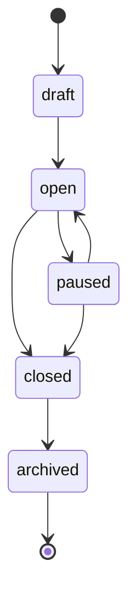

## Candidate Pipeline

Candidate pipeline state is tracked on `MissionCandidate`, not on `Candidate`. This preserves candidate history across multiple recruitment missions.

### Confirmed Stage Mapping

| Confirmed stage | Normalized state |
| --- | --- |
| `NEW` | `new` |
| `CV_TO_REVIEW` | `cv_to_review` |
| `HR_PRESELECTION` | `hr_preselection` |
| `HR_INTERVIEW_SCHEDULED` | `hr_interview_scheduled` |
| `HR_INTERVIEW_COMPLETED` | `hr_interview_completed` |
| `TECHNICAL_TEST` | `technical_test` |
| `INTERNAL_VALIDATION` | `internal_validation` |
| `PRESENTED_TO_CLIENT` | `presented_to_client` |
| `CLIENT_INTERVIEW_1` | `client_interview_1` |
| `CLIENT_INTERVIEW_2` | `client_interview_2` |
| `CLIENT_OFFER` | `client_offer` |
| `ACCEPTED` | `accepted` |
| `INTEGRATED` | `integrated` |
| `PROBATION_COMPLETED` | `probation_completed` |
| `PROCESS_COMPLETED` | `process_completed` |

### Exceptional and Outcome States

- `waiting`: waiting for information, availability, internal action, or client response.
- `postponed`: scheduled activity delayed.
- `candidate_rejected`: Hire Me rejected the candidate for this mission, or the candidate declined before offer acceptance.
- `client_rejected`: client rejected the candidate.
- `withdrawn`: candidate withdrew from the mission.
- `talent_pool`: candidate is not active for this mission but should be retained for future opportunities.

### Terminal States

- `candidate_rejected`
- `client_rejected`
- `withdrawn`
- `talent_pool`
- `process_completed`

`accepted`, `integrated`, and `probation_completed` are not terminal by themselves because the confirmed process continues through integration, probation completion, and final process completion. Accepted candidates do not count as placements. Placement count changes only after offer-backed placement confirmation from the current accepted offer version by an authorized user, and recruitment mission closure is never automatic.

### Optional Skips

Only these standard-pipeline skips are approved:

| From | To | Requirement |
| --- | --- | --- |
| `HR_INTERVIEW_COMPLETED` | `INTERNAL_VALIDATION` | Explicit skip flag, required reason, and audit event. |
| `CLIENT_INTERVIEW_1` | `CLIENT_OFFER` | Explicit skip flag, required reason, and audit event. |

All other transitions must follow the standard pipeline or approved exceptional/outcome paths.

`PRESENTED_TO_CLIENT` is a pipeline state, but it is not reachable through the generic transition endpoint. The dedicated presentation action is the only operation that may enter this state, and it must atomically set client visibility, presentation timestamp, presenter identity, process history, and safe audit history.

Integration confirmation is idempotent. The first successful confirmation records the timestamp, confirmer, process event, safe audit event, and one placement-count increment. Retrying the same confirmation returns the already-confirmed process without changing placement count, confirmation metadata, process-event history, or audit history.

## Offer and Placement Workflow

Offer and placement records are internal staff-controlled business records. Candidates do not have accounts, dashboards, or public offer-acceptance actions in this workflow. Hire Me staff records negotiation outcomes from controlled internal screens.

An offer belongs to exactly one `MissionCandidate`. Revisions create new immutable versions and preserve the prior version history. Only one current active offer version can exist for a process at a time.

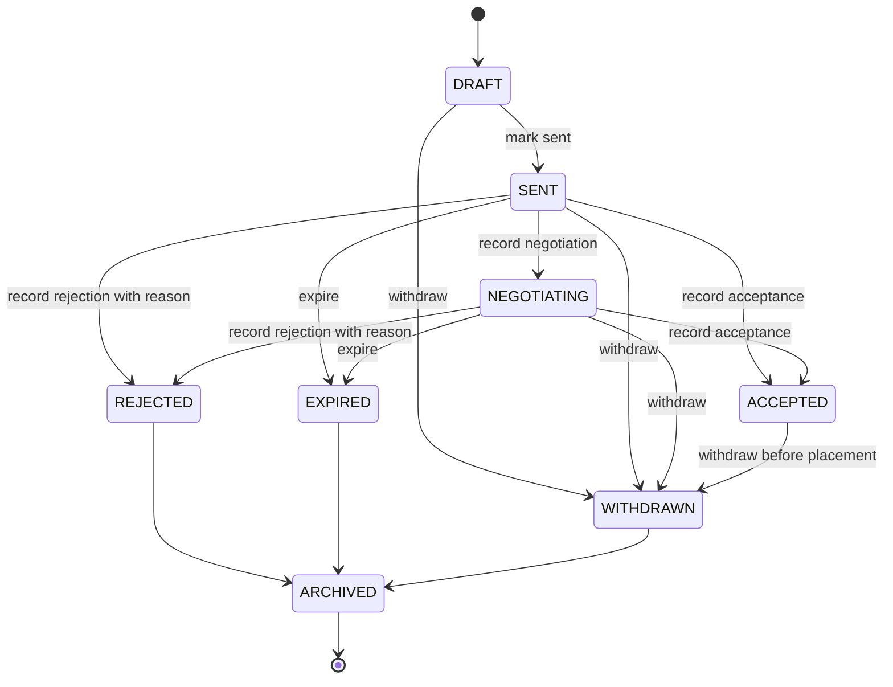

Placement confirmation is separate from offer acceptance:

- `ACCEPTED` records the candidate or client-side offer outcome but does not increment `filledPlacementCount`.
- Placement confirmation requires the current accepted offer version and an authorized internal actor.
- The first confirmation creates `MissionPlacement`, records integration metadata, increments `filledPlacementCount` once, and can mark the placement eligible for future invoicing.
- Repeated or concurrent confirmation is a no-op after the first successful write and must not create duplicate placement, process, or audit history.
- Placement correction requires a structured reason, preserves the original confirmation timestamp and confirmer, decrements `filledPlacementCount` at most once, removes commercial eligibility when present, and cannot make the count negative.
- Reaching mission capacity makes the mission eligible for closure but never closes it automatically. Managers can keep recruiting after capacity is reached.
- The legacy `confirm-integration` route is retired as an independent mutation and returns `PLACEMENT_OFFER_CONFIRMATION_REQUIRED`; ordinary pipeline transitions also cannot enter `INTEGRATED`. Historical `MissionCandidate.placementConfirmedAt` rows remain compatibility data until a separate audited reconciliation maps them to canonical `MissionPlacement` rows.

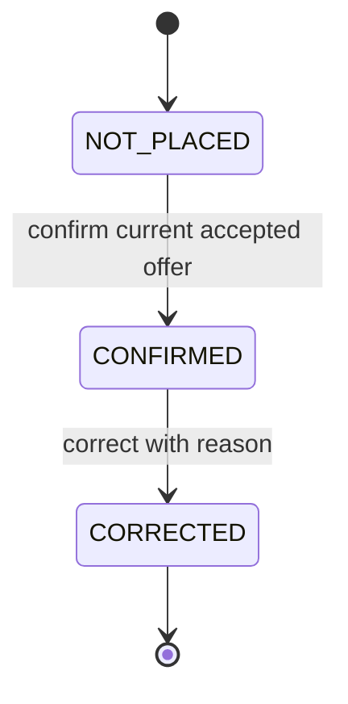

### Valid Transitions

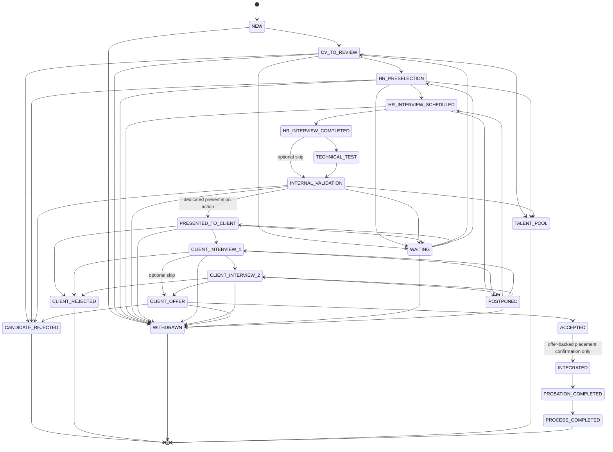

## Interview Workflow

Interview state is tracked on `Interview`, which belongs to one `MissionCandidate`. Interview actions do not automatically move `MissionCandidate.state`; pipeline transitions remain explicit candidate-process actions.

### Interview Types

- `HR`: HR interview.
- `TECHNICAL`: technical interview or technical-test review meeting.
- `INTERNAL_VALIDATION`: internal validation meeting.
- `CLIENT_INTERVIEW_1`: first client interview.
- `CLIENT_INTERVIEW_2`: optional second client interview.

Client interview scheduling requires `MissionCandidate.clientVisible = true` through explicit presentation. In current documentation, `clientVisible` means approved for external sharing; it does not imply that a client portal exists in the MVP. `CLIENT_INTERVIEW_2` requires an existing `CLIENT_INTERVIEW_1` that is completed or postponed. This preserves the confirmed external-sharing boundary and avoids silent pipeline movement.

### Interview States

- `SCHEDULED`: interview has a planned start time.
- `POSTPONED`: interview is delayed and needs rescheduling.
- `COMPLETED`: interview occurred.
- `CANCELED`: interview will not occur.
- `ARCHIVED`: interview is retained but inactive.

Rescheduling and postponement require a reason and create `InterviewEvent` history. Completion and cancellation are idempotent: repeating either operation returns the existing terminal interview without another event or audit record, and cancellation retries preserve the original `canceledAt` timestamp and reason history. Canceling a completed interview is rejected with a stable conflict.

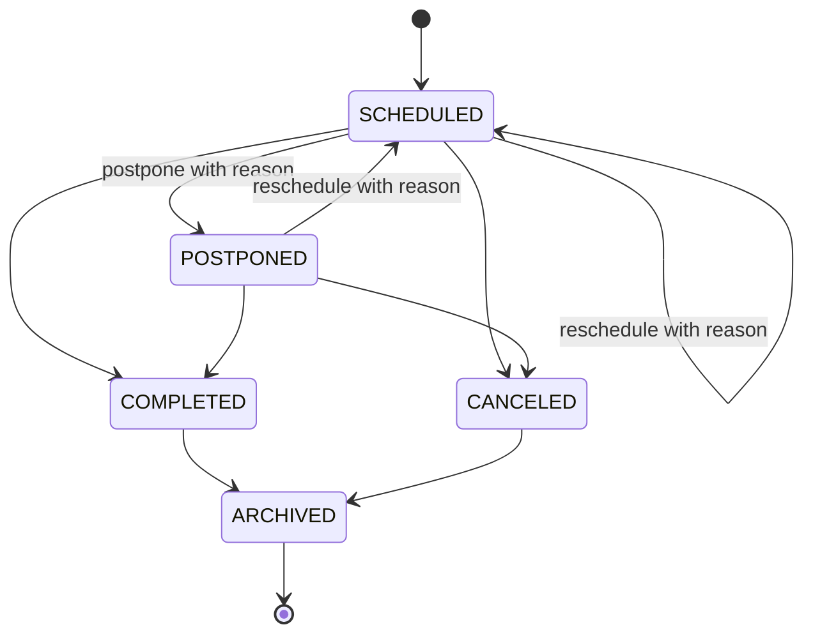

## Evaluation Workflow

`CandidateEvaluation` is a structured business record created under one interview by an authorized internal evaluator. It is not a document and does not expose raw candidate salary values in responses or audit metadata.

### Evaluation States

- `DRAFT`: author can update the structured evaluation.
- `SUBMITTED`: finalized evaluation; finalization is explicit and idempotent.
- `ARCHIVED`: retained but inactive.

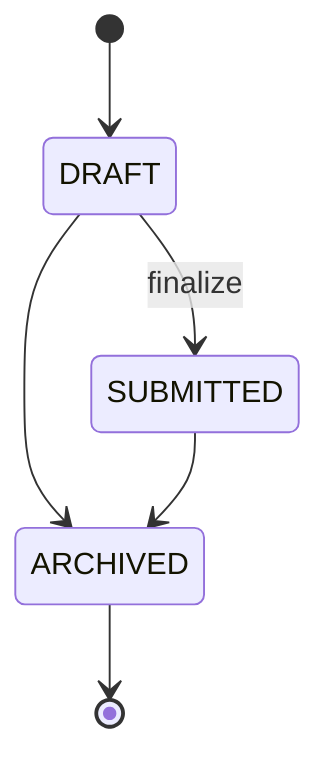

## Recruitment Mission Pipeline

Recruitment mission state is tracked on `RecruitmentMission`. Candidate-specific progress is tracked on `MissionCandidate`, but the mission state should reflect the overall recruitment process.

### Confirmed Stage Mapping

| Confirmed mission stage | Normalized state |
| --- | --- |
| Brouillon | `draft` |
| Validation interne | `internal_validation` |
| Active | `active` |
| Fiche de poste validée | `job_description_approved` |
| Sourcing des candidats | `candidate_sourcing` |
| Présélection RH | `hr_preselection` |
| Entretiens RH | `hr_interviews` |
| Tests techniques | `technical_tests` |
| Présentation des candidats | `candidate_presentation` |
| Entretiens client | `client_interviews` |
| Sélection finale | `final_selection` |
| Offre envoyée | `offer_sent` |
| Candidat intégré | `candidate_integrated` |
| Suivi période d'essai | `probation_monitoring` |
| Mission clôturée | `closed_with_recruitment` or `closed_without_recruitment` |

### Exceptional and Outcome States

- `waiting_for_client_information`: blocked pending client details or decision.
- `paused`: intentionally paused or suspended.
- `canceled`: canceled before completion.
- `closed_without_recruitment`: closed with no successful placement.
- `closed_with_recruitment`: closed after successful placement.
- `deadline_expired_without_renewal`: deadline expired and the mission was not renewed.
- `archived`: retained but inactive.

### Terminal States

- `closed_with_recruitment`
- `closed_without_recruitment`
- `deadline_expired_without_renewal`
- `canceled`
- `archived`

### Confirmed Closure Reasons

`closureReason` is required or strongly recommended when a mission closes. Confirmed business reasons are:

- `client_closed_or_canceled`: the client closed or canceled the mission.
- `closed_without_recruitment`: the mission ended without recruitment.
- `deadline_expired_without_renewal`: the deadline expired and was not renewed.
- `positions_filled_and_candidates_integrated`: all planned positions are filled and candidates are integrated, optionally after probation validation.

Successful closure with recruitment must consider `numberOfPositions` and filled-placement count. Issue #19 implements the structured closure reasons as `CLIENT_CLOSED_OR_CANCELED`, `CLOSED_WITHOUT_RECRUITMENT`, `DEADLINE_EXPIRED_WITHOUT_RENEWAL`, and `POSITIONS_FILLED_AND_CANDIDATES_INTEGRATED` in shared contracts and Prisma while preserving the lowercase business values in database mappings.

### Valid Transitions

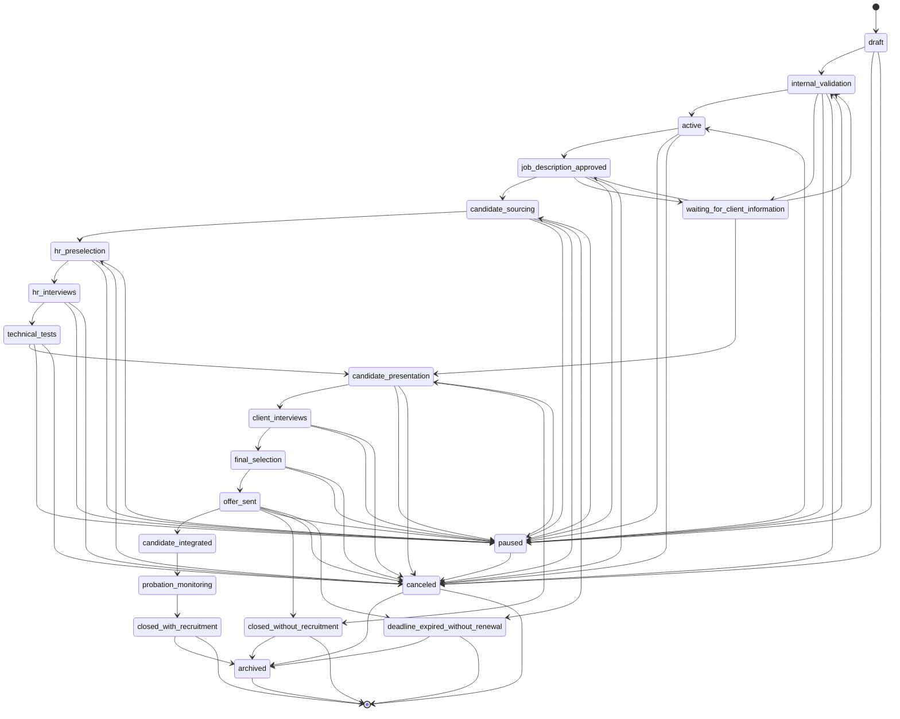

Issue #19 enforces the transition graph above through the API. Non-terminal moves use `PATCH /v1/missions/:missionId/status`; terminal operational closure uses `POST /v1/missions/:missionId/close` with a structured closure reason; archival uses `POST /v1/missions/:missionId/archive` after closure or cancellation. Mission closure, archival, status changes, ordinary updates, assignment writes, assignment activation eligibility, lead-recruiter replacement, and effective salary-range validation use the same parent-mission PostgreSQL row lock so concurrent archival, closure, user lifecycle changes, or partial commercial updates cannot bypass invariants.

## Training Workflow

Training workflow uses `TrainingProgram`, `TrainingSession`, `TrainingEnrollment`, and `TrainingSessionParticipation`.

`TrainingProgram` owns the overall program lifecycle and can contain multiple sessions. `TrainingSession` owns one scheduled delivery event. `TrainingEnrollment` owns program-level participant registration, approval, optional payment, evaluation, certificate, satisfaction, coaching, and follow-up state. `TrainingSessionParticipation` owns per-session attendance and session-level participant outcomes.

### TrainingProgram States

- `program_draft`: program is being created.
- `program_active`: program is available for sessions and enrollment.
- `program_closed`: program is closed for new enrollment or delivery.
- `program_archived`: program is retained but inactive.

### TrainingSession States

- `session_planned`: session is being planned.
- `session_scheduled`: session date, trainer, and location or link are set.
- `session_in_progress`: session is active.
- `session_completed`: session delivery is complete.
- `session_postponed`: session is delayed and needs rescheduling.
- `session_canceled`: session will not happen.
- `session_archived`: session is retained but inactive.

### Enrollment States

- `registered`: participant registration exists.
- `approval_pending`: participant needs approval.
- `approved`: participant is approved.
- `payment_pending`: optional payment is pending.
- `enrolled`: participant is enrolled in the program.
- `evaluated`: evaluation outcome recorded.
- `individual_coaching`: individual coaching is active or scheduled.
- `certificate_issued`: certificate was issued.
- `satisfaction_recorded`: satisfaction assessment completed.
- `follow_up`: post-training follow-up is active.
- `closed`: participant training lifecycle is closed.
- `rejected`: registration was rejected.
- `canceled`: participant enrollment was canceled.

### TrainingSessionParticipation States

- `expected`: participant is expected for a session.
- `attended`: participant attended the session.
- `absent`: participant was absent.
- `excused`: participant absence is excused.
- `session_outcome_recorded`: session-level participant outcome is recorded.
- `participation_archived`: participation record is retained but inactive.

### Terminal States

- `closed`
- `rejected`
- `canceled`
- `program_archived`
- `session_archived`
- `participation_archived`

### Valid Program Transitions

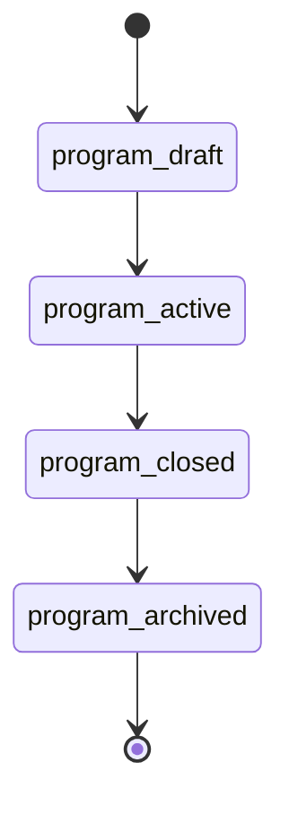

### Valid Session Transitions

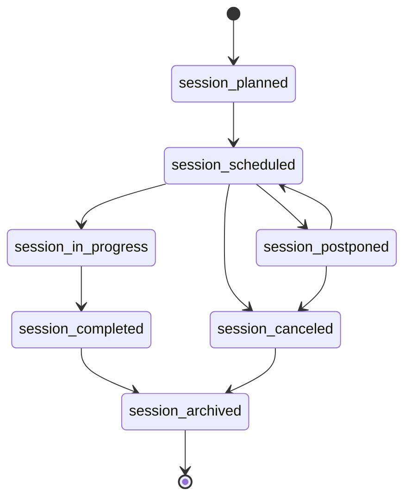

### Valid Enrollment Transitions

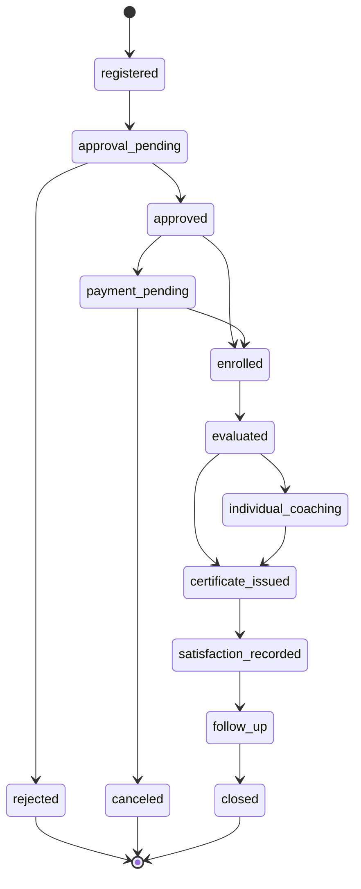

### Valid Session Participation Transitions

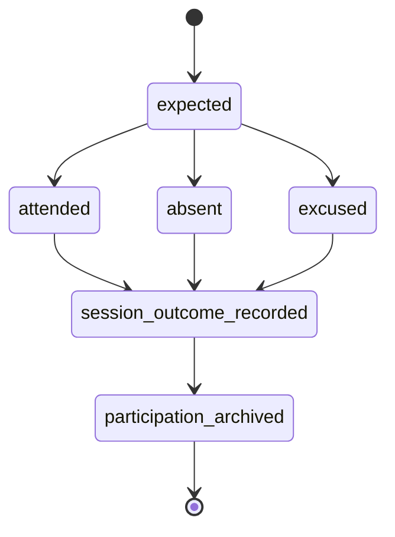

### Valid Task Transitions

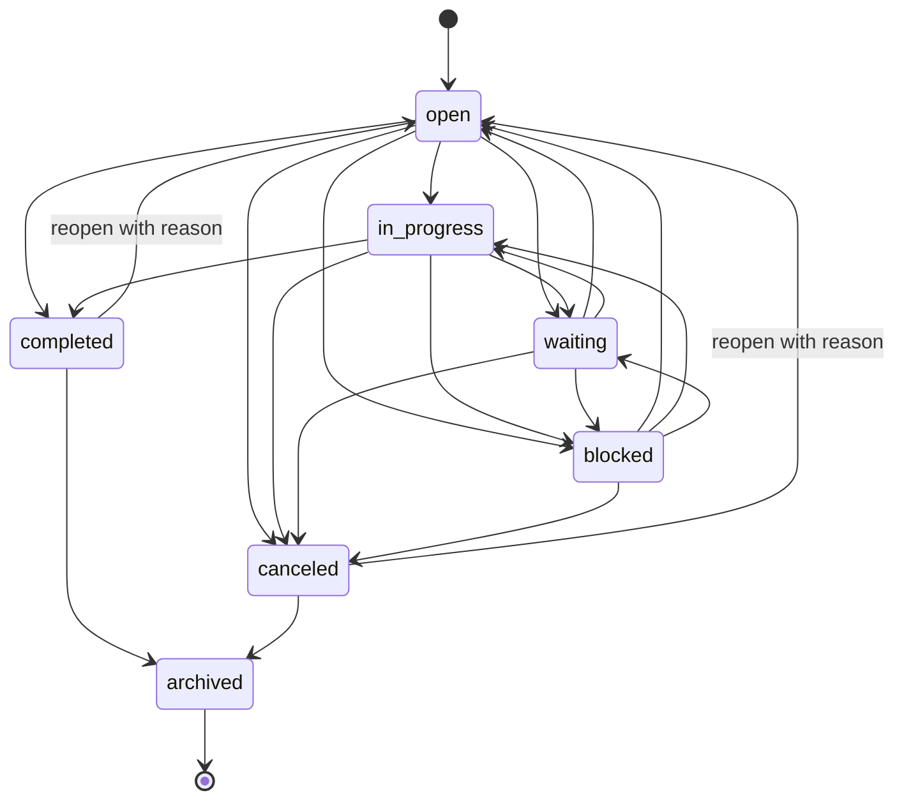

Task lifecycle rules:

- Every task has one accountable internal owner and can have multiple active assignees through normalized assignment records.
- Assignment removal preserves history instead of deleting prior responsibility.
- Blocking, cancellation, reopening, and archival require safe reason metadata.
- Completion, cancellation, and archival cancel pending or failed reminders that are no longer relevant.
- Retrying a completion, cancellation, or archive after the first successful terminal write returns the existing state without duplicate history or audit entries.
- Task comments are internal business records. Explicit mentions identify user IDs and do not grant access; a mentioned user must already be able to view the task.
- Task reminders are durable in-app reminders only. Issue #31 does not implement email, WhatsApp, calendar, browser, mobile-push, or external notification delivery.
- Due reminder workers discover pending or failed due reminder IDs, then serialize each delivery through parent `Task` and `TaskReminder` row locks with state rechecks, and create task notifications through idempotency keys so concurrent workers create at most one notification.
- Overdue task notifications are task-generated in-app notifications and must not include confidential candidate, salary, client, commercial, HR note, or comment-body payloads.

## Transition Rules

- Only authorized internal users can transition workflow states.
- Candidate applicants do not transition internal workflow states through public application links.
- Client users are optional future actors; in the MVP, Hire Me staff records client feedback and decisions internally.
- State transitions involving client presentation, rejection, withdrawal, talent pool, document sharing, offer, integration, probation, mission closure reason, archival, cancellation, enrollment approval, payment status, session attendance, certificate, and commercial data should be audited.
- Reopening terminal states is not supported in the MVP unless a later issue defines recovery rules.

## Assumptions

- State names are stable code identifiers for future implementation.
- Archival keeps records available for audits and reporting while hiding them from active operational views.
- Candidate-level availability can differ from `MissionCandidate` pipeline state.
- Mission state summarizes the overall recruitment process; candidate-specific progress remains on `MissionCandidate`.
- Training program state, training session state, enrollment state, and session participation state are separate because a program contains multiple sessions and each participant can have different per-session attendance.

## Unresolved Technical Choices

- Whether `MissionCandidate` can move backward to earlier active states and which roles can do that.
- Whether client feedback can create tasks automatically.
- Exact enum names for mission `closureReason`; structured closure reasons are confirmed.
- Production public opportunity URL/token strategy beyond opaque slugs, CAPTCHA provider, malware scanner, retention schedule, and applicant duplicate-review workflow.
- How `TrainingEnrollment` payment status integrates with the later commercial-accounting module.
- Commercial accounting workflows for quotations, recruitment contracts, training contracts, purchase orders, invoices, payments, partial payments, overdue balances, expenses, VAT/tax fields, balances, and profitability.
- Whether future task automation can create tasks from client feedback, documents, imports, integrations, or accounting events.
- Whether workflow state names become database enums or shared constants.

## Risks

- Allowing future client users to drive internal states can compromise process control.
- Exposing unapproved public opportunity fields can leak confidential client, salary, commercial, recruiter, or pipeline data.
- Missing transition audit logs can weaken accountability for candidate, client, training, and commercial decisions.
- Reopening terminal states without clear rules can corrupt reporting.
- Aggregating confirmed stages would hide business process detail required for later tasks.

## Non-Goals

- No workflow engine implementation.
- No database enum definitions.
- No automation rules beyond documenting future background job needs.
