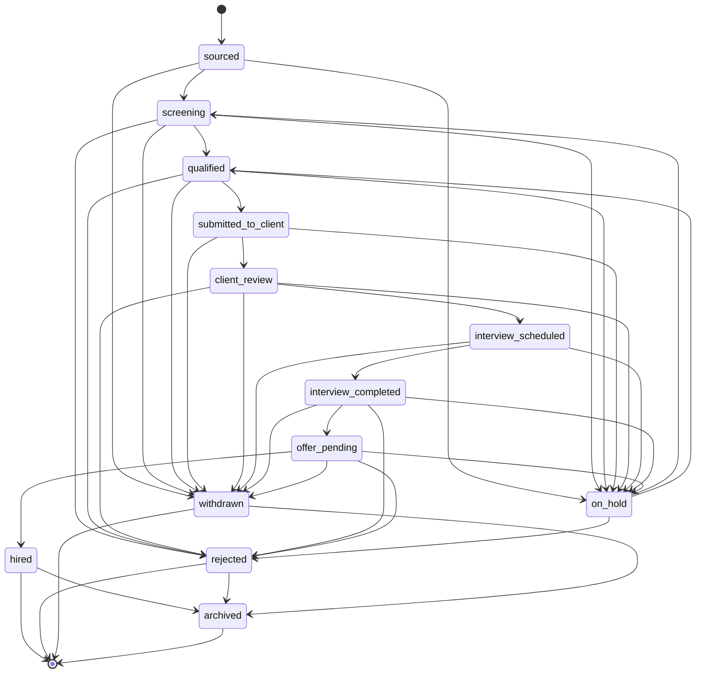
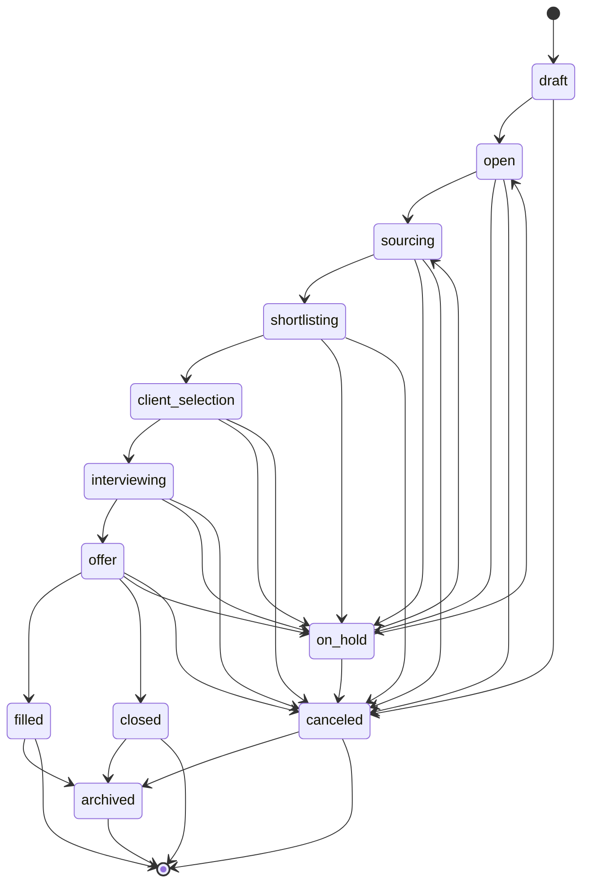
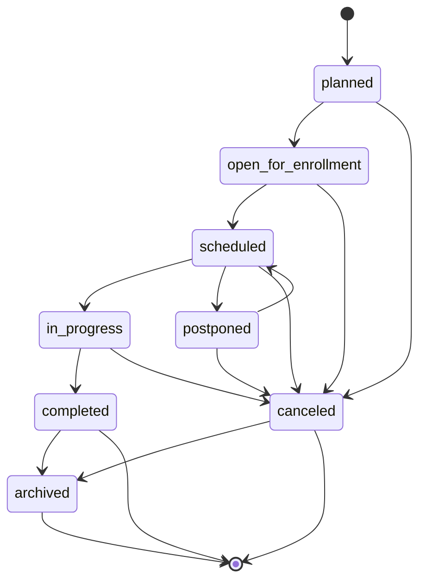

# Workflows

Workflow state changes must be authorized on the backend, auditable when sensitive, and consistent with the entity names in `docs/domain-model.md`.

## Candidate Pipeline

Candidate pipeline state is tracked on `MissionCandidate`, not on `Candidate`. This preserves candidate history across multiple recruitment missions.

### States

- `sourced`: candidate has been identified for a recruitment mission.
- `screening`: candidate is being reviewed by the internal team.
- `qualified`: candidate meets initial mission requirements.
- `submitted_to_client`: candidate has been shared with the client.
- `client_review`: client is reviewing the candidate.
- `interview_scheduled`: at least one interview is scheduled.
- `interview_completed`: interview feedback is expected or recorded.
- `offer_pending`: client or internal team is preparing a final decision or offer.
- `hired`: candidate accepted and the mission candidate flow is complete.
- `rejected`: candidate is no longer considered for this mission.
- `withdrawn`: candidate withdrew from the mission.
- `on_hold`: candidate progress is paused.
- `archived`: mission candidate record is retained but inactive.

### Terminal States

- `hired`
- `rejected`
- `withdrawn`
- `archived`

`hired`, `rejected`, and `withdrawn` are terminal business outcome states. They may still transition to `archived` as an administrative retention step, but they should not return to active candidate processing in the MVP.

### Exceptional States

- `on_hold`
- `withdrawn`
- `archived`

### Valid Transitions

## Recruitment Mission Pipeline

Recruitment mission state is tracked on `RecruitmentMission`.

### States

- `draft`: mission is being prepared internally.
- `open`: mission is approved and active.
- `sourcing`: candidate sourcing is underway.
- `shortlisting`: candidates are being selected for client submission.
- `client_selection`: client is reviewing submitted candidates.
- `interviewing`: interviews are being scheduled or completed.
- `offer`: final offer or hiring decision is underway.
- `filled`: mission has at least one accepted hire.
- `closed`: mission is complete without an accepted hire or with no further action.
- `canceled`: mission was canceled before completion.
- `on_hold`: mission is paused.
- `archived`: mission is retained but inactive.

### Terminal States

- `filled`
- `closed`
- `canceled`
- `archived`

`filled`, `closed`, and `canceled` are terminal business outcome states. They may still transition to `archived` as an administrative retention step, but they should not return to active mission processing in the MVP.

### Exceptional States

- `on_hold`
- `canceled`
- `archived`

### Valid Transitions

## Training Workflow

Training workflow state is tracked on `TrainingSession`. `TrainingProgram` groups related sessions and can have its own draft, active, retired, and archived lifecycle during implementation.

### States

- `planned`: training session is being prepared.
- `open_for_enrollment`: participants can be added.
- `scheduled`: session date, trainer, and participants are confirmed.
- `in_progress`: session is active.
- `completed`: session has finished and outcomes are recorded.
- `postponed`: session is delayed and needs rescheduling.
- `canceled`: session will not happen.
- `archived`: session is retained but inactive.

### Terminal States

- `completed`
- `canceled`
- `archived`

`completed` and `canceled` are terminal business outcome states. They may still transition to `archived` as an administrative retention step, but they should not return to active training processing in the MVP.

### Exceptional States

- `postponed`
- `canceled`
- `archived`

### Valid Transitions

## Transition Rules

- Only authorized internal users can transition workflow states.
- Client users may provide feedback only where explicitly authorized; they should not directly control internal workflow state in the MVP.
- State transitions involving client submission, rejection, withdrawal, document sharing, offer, archival, or cancellation should be audited.
- Reopening terminal states is not supported in the MVP unless a later issue defines recovery rules.

## Assumptions

- State names are stable code identifiers for future implementation.
- Archival keeps records available for audits and reporting while hiding them from active operational views.
- Candidate-level availability can differ from `MissionCandidate` pipeline state.
- Training participant attendance and outcomes may need participant-level statuses later.

## Unresolved Decisions

- Whether `MissionCandidate` can move backward to earlier active states.
- Whether client feedback can create tasks automatically.
- Whether training needs participant-level states such as invited, attended, absent, and passed.
- Whether mission `closed` requires a closure reason.

## Risks

- Allowing client users to drive internal states can compromise process control.
- Missing transition audit logs can weaken accountability for candidate and client decisions.
- Reopening terminal states without clear rules can corrupt reporting.
- Overly complex first-phase workflows can slow implementation and adoption.

## Non-Goals

- No workflow engine implementation.
- No database enum definitions.
- No automation rules beyond documenting future background job needs.
