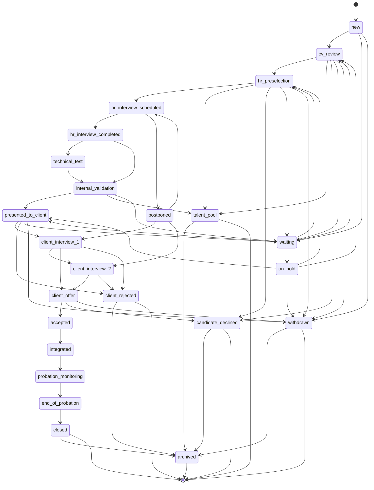
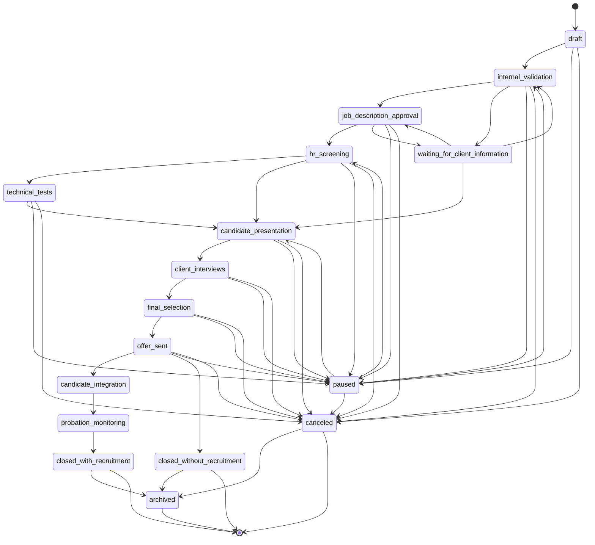
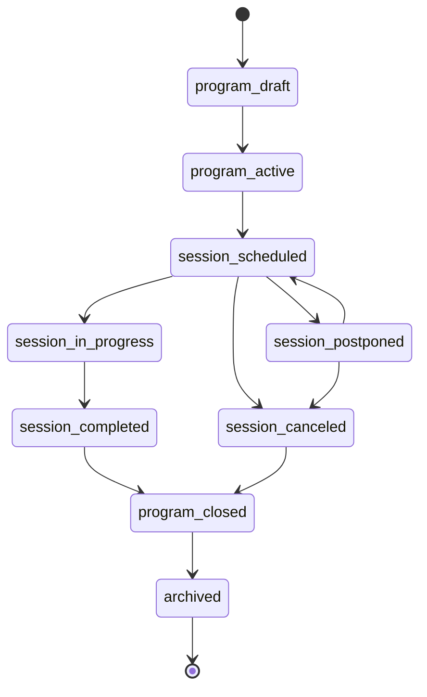
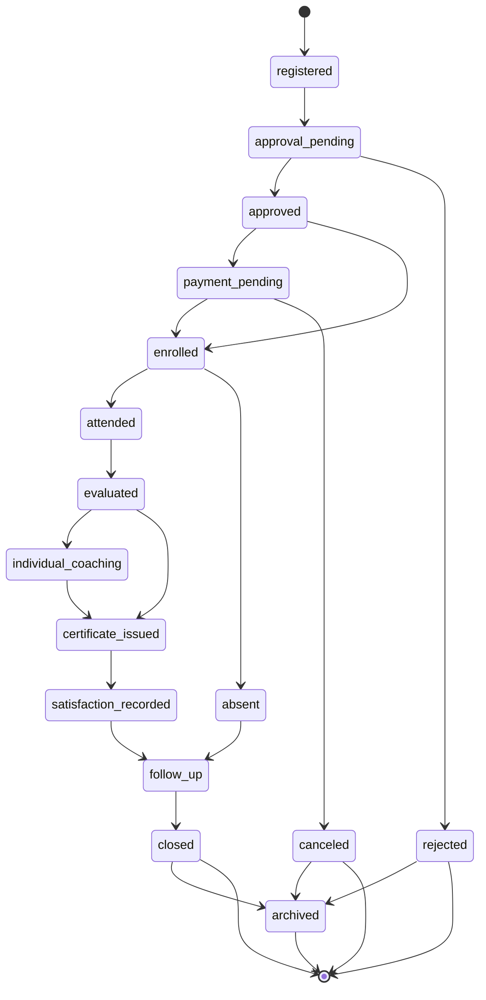

# Workflows

Workflow state changes must be authorized on the backend, auditable when sensitive, and consistent with the entity names in `docs/domain-model.md`.

## Confirmed Requirement Versus Implementation Sequence

The stages below are confirmed product requirements. Implementation may be delivered module by module, but documents and code should not remove or silently aggregate the confirmed stages. Where normalized state names differ from questionnaire labels, the mapping is explicit.

## Candidate Pipeline

Candidate pipeline state is tracked on `MissionCandidate`, not on `Candidate`. This preserves candidate history across multiple recruitment missions.

### Confirmed Stage Mapping

| Confirmed stage | Normalized state |
| --- | --- |
| `NEW` | `new` |
| `CV_REVIEW` | `cv_review` |
| `HR_PRESELECTION` | `hr_preselection` |
| `HR_INTERVIEW_SCHEDULED` | `hr_interview_scheduled` |
| `HR_INTERVIEW_COMPLETED` | `hr_interview_completed` |
| `TECHNICAL_TEST` | `technical_test` |
| `INTERNAL_VALIDATION` | `internal_validation` |
| `PRESENTED_TO_CLIENT` | `presented_to_client` |
| `CLIENT_INTERVIEW_1` | `client_interview_1` |
| `CLIENT_INTERVIEW_2` | `client_interview_2` |
| `CLIENT_OFFER` | `client_offer` |
| `ACCEPTED` | `accepted` |
| `INTEGRATED` | `integrated` |
| `PROBATION_MONITORING` | `probation_monitoring` |
| `END_OF_PROBATION` | `end_of_probation` |
| `CLOSED` | `closed` |

### Exceptional and Outcome States

- `waiting`: waiting for information, availability, internal action, or client response.
- `on_hold`: intentionally paused.
- `postponed`: scheduled activity delayed.
- `candidate_declined`: candidate declined or refused to continue.
- `client_rejected`: client rejected the candidate.
- `withdrawn`: candidate withdrew from the mission.
- `talent_pool`: candidate is not active for this mission but should be retained for future opportunities.
- `archived`: retained but inactive.

### Terminal States

- `closed`
- `candidate_declined`
- `client_rejected`
- `withdrawn`
- `talent_pool`
- `archived`

`accepted`, `integrated`, `probation_monitoring`, and `end_of_probation` are not terminal by themselves because the confirmed process continues through integration, probation, and closure.

### Valid Transitions

## Recruitment Mission Pipeline

Recruitment mission state is tracked on `RecruitmentMission`. Candidate-specific progress is tracked on `MissionCandidate`, but the mission state should reflect the overall recruitment process.

### Confirmed Stage Mapping

| Confirmed mission stage | Normalized state |
| --- | --- |
| mission creation | `draft` |
| internal validation | `internal_validation` |
| job-description approval | `job_description_approval` |
| HR preselection and interviews | `hr_screening` |
| technical tests | `technical_tests` |
| candidate presentation | `candidate_presentation` |
| client interviews | `client_interviews` |
| final selection | `final_selection` |
| offer sent | `offer_sent` |
| candidate integration | `candidate_integration` |
| probation monitoring | `probation_monitoring` |
| closure | `closed_with_recruitment` or `closed_without_recruitment` |

### Exceptional and Outcome States

- `waiting_for_client_information`: blocked pending client details or decision.
- `paused`: intentionally paused or suspended.
- `canceled`: canceled before completion.
- `closed_without_recruitment`: closed with no successful placement.
- `closed_with_recruitment`: closed after successful placement.
- `archived`: retained but inactive.

### Terminal States

- `closed_with_recruitment`
- `closed_without_recruitment`
- `canceled`
- `archived`

### Valid Transitions

## Training Workflow

Training workflow uses `TrainingProgram`, `TrainingSession`, and `TrainingEnrollment`. `TrainingEnrollment` owns participant-specific registration, approval, optional payment, attendance, evaluation, certificate, satisfaction, coaching, and follow-up state.

### Program and Session States

- `program_draft`: program is being created.
- `program_active`: program is available for sessions and enrollment.
- `session_scheduled`: session date, trainer, and location or link are set.
- `session_in_progress`: session is active.
- `session_completed`: session delivery is complete.
- `session_postponed`: session is delayed and needs rescheduling.
- `session_canceled`: session will not happen.
- `program_closed`: program is closed for new activity.
- `archived`: retained but inactive.

### Enrollment States

- `registered`: participant registration exists.
- `approval_pending`: participant needs approval.
- `approved`: participant is approved.
- `payment_pending`: optional payment is pending.
- `enrolled`: participant is enrolled in the session or program.
- `attended`: attendance recorded as present.
- `absent`: attendance recorded as absent.
- `evaluated`: evaluation outcome recorded.
- `individual_coaching`: individual coaching is active or scheduled.
- `certificate_issued`: certificate was issued.
- `satisfaction_recorded`: satisfaction assessment completed.
- `follow_up`: post-training follow-up is active.
- `closed`: participant training lifecycle is closed.
- `rejected`: registration was rejected.
- `canceled`: participant enrollment was canceled.

### Terminal States

- `closed`
- `rejected`
- `canceled`
- `archived`

### Valid Program and Session Transitions

### Valid Enrollment Transitions

## Transition Rules

- Only authorized internal users can transition workflow states.
- Client users may provide feedback only where explicitly authorized; they should not directly control internal workflow state in the MVP.
- State transitions involving client presentation, rejection, withdrawal, talent pool, document sharing, offer, integration, probation, archival, cancellation, enrollment approval, payment status, certificate, and commercial data should be audited.
- Reopening terminal states is not supported in the MVP unless a later issue defines recovery rules.

## Assumptions

- State names are stable code identifiers for future implementation.
- Archival keeps records available for audits and reporting while hiding them from active operational views.
- Candidate-level availability can differ from `MissionCandidate` pipeline state.
- Mission state summarizes the overall recruitment process; candidate-specific progress remains on `MissionCandidate`.
- Training session delivery state and participant enrollment state are separate because participants can have different attendance, payment, evaluation, certificate, satisfaction, coaching, and follow-up outcomes.

## Unresolved Technical Choices

- Whether `MissionCandidate` can move backward to earlier active states and which roles can do that.
- Whether client feedback can create tasks automatically.
- Whether mission `closed_with_recruitment` and `closed_without_recruitment` require structured closure reasons.
- Whether payment status in `TrainingEnrollment` is operational tracking only or later integrates with accounting.
- Whether workflow state names become database enums or shared constants.

## Risks

- Allowing client users to drive internal states can compromise process control.
- Missing transition audit logs can weaken accountability for candidate, client, training, and commercial decisions.
- Reopening terminal states without clear rules can corrupt reporting.
- Aggregating confirmed stages would hide business process detail required for later tasks.

## Non-Goals

- No workflow engine implementation.
- No database enum definitions.
- No automation rules beyond documenting future background job needs.
